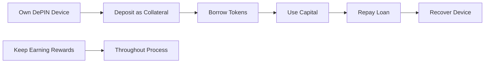

# Getting Started with InfraFi

Welcome to InfraFi Protocol! This section will help you get up and running quickly, whether you're new to DePIN or an experienced infrastructure operator.


**New here?** Start with [Prerequisites](prerequisites.md) to ensure you have everything needed, then follow our [Quick Start Guide](quickstart.md) to make your first transaction.


## What You'll Learn

This getting started guide covers everything you need to begin using InfraFi Protocol:

### 🎯 **Essential Steps**
1. **[Prerequisites](prerequisites.md)** - Required setup and accounts
2. **[Your First Loan](quickstart.md)** - Complete walkthrough  
3. **[Safety Guidelines](safety-guidelines.md)** - Best practices and risk management

### 📚 **Background Knowledge**
- Understanding DePIN and infrastructure lending
- OORT Network basics and node ownership
- DeFi lending concepts and terminology
- Risk factors and mitigation strategies

## Quick Overview

### What is InfraFi?
InfraFi Protocol lets you **borrow tokens using your DePIN devices as collateral** while keeping your devices operational and earning rewards.

### Core Process

### Supported Assets (Current)
- ✅ **OORT Compute Nodes** - Edge computing infrastructure
- 🔄 **Coming Soon** - Helium, Filecoin, Render Network

## Before You Start

### ⚠️ **Important Notices**


**Testnet Environment**: The current deployment is on OORT testnet for testing purposes. Never use real mainnet assets with testnet contracts.



**Learning Environment**: This is a safe space to learn without financial risk. All tokens are testnet tokens with no real value.


### 🔍 **What You Need**

| Requirement | Description | Where to Get |
|-------------|-------------|--------------|
| **OORT Wallet** | Web3 wallet connected to OORT testnet | MetaMask, WalletConnect |
| **OORT Node** | Physical device you own and control | [OORT Network](https://oortech.com) |
| **Testnet OORT** | Gas fees for transactions | [OORT Faucet](https://faucet.oortech.com) |
| **Basic DeFi Knowledge** | Understanding of lending concepts | Our [Resources](../resources/) section |

## Learning Path

### 👶 **Complete Beginner**
1. Read [What is InfraFi?](../overview/) to understand the basics
2. Review [Prerequisites](prerequisites.md) and complete setup
3. Follow [Quick Start Guide](quickstart.md) step-by-step
4. Study [Safety Guidelines](safety-guidelines.md) for best practices

### 🔰 **DeFi Experienced**  
1. Skim [Key Features](../overview/key-features.md) for differentiators
2. Check [Prerequisites](prerequisites.md) for OORT-specific requirements
3. Jump to [Quick Start Guide](quickstart.md) for hands-on experience
4. Explore [Protocol Deep Dive](../protocol/) for technical details

### 🏗️ **Infrastructure Operator**
1. Review [Market Opportunity](../overview/market-opportunity.md) for business case
2. Complete [Prerequisites](prerequisites.md) setup
3. Try [Quick Start Guide](quickstart.md) with test nodes
4. Plan integration with [User Guides](../guides/) for production

## Success Checklist

Use this checklist to track your onboarding progress:

### Setup Phase
- [ ] Web3 wallet configured for OORT testnet
- [ ] OORT testnet tokens acquired for gas fees
- [ ] OORT node ownership verified in native protocol
- [ ] InfraFi app accessed and wallet connected

### Learning Phase  
- [ ] Understand proxy-based custody concept
- [ ] Know your device's collateral value
- [ ] Familiar with interest rate calculation
- [ ] Aware of liquidation risks and thresholds

### Practice Phase
- [ ] Successfully deposited a test node
- [ ] Borrowed tokens against collateral  
- [ ] Monitored loan-to-value ratio
- [ ] Repaid loan and recovered node ownership

### Mastery Phase
- [ ] Comfortable with all basic operations
- [ ] Understand advanced risk management
- [ ] Ready for mainnet when available
- [ ] Can help others get started

## Common Questions

### "Is this safe to try?"
Yes! The testnet environment uses test tokens with no real value. It's specifically designed for safe learning and experimentation.

### "Do I need technical knowledge?"
Basic DeFi familiarity helps, but our guides are designed for non-technical users. If you can use other DeFi protocols, you can use InfraFi.

### "What if something goes wrong?"
Testnet issues have no real financial impact. Our community is active in Discord to help with any questions or problems.

### "How long does it take to learn?"
Most users complete their first transaction within 30 minutes. Becoming comfortable with all features typically takes a few hours of practice.

## Getting Help

### 💬 **Community Support**
- **Discord**: Real-time help from community and team
- **Governance Forum**: Technical discussions and feedback
- **GitHub Issues**: Bug reports and feature requests

### 📖 **Documentation**
- **[User Guides](../guides/)**: Detailed step-by-step instructions
- **[Protocol Docs](../protocol/)**: Technical architecture and mechanics  
- **[FAQ](../resources/faq.md)**: Common questions and answers
- **[Glossary](../resources/glossary.md)**: DePIN and DeFi terminology

### 🔧 **Developer Resources**
- **[API Docs](../developers/)**: Integration guides and references
- **[Contract Addresses](../developers/contract-addresses.md)**: Testnet deployment info
- **[GitHub Repository](https://github.com/infrafi)**: Open source code

## What's Next?

Ready to begin? Choose your path:

<table data-view="cards">
<thead>
<tr>
<th></th>
<th></th>
<th></th>
<th data-hidden data-card-target data-type="content-ref"></th>
</tr>
</thead>
<tbody>
<tr>
<td>🚀 <strong>Start Now</strong></td>
<td>Jump right into the action</td>
<td>Quick Start Guide</td>
<td><a href="quickstart.md">quickstart.md</a></td>
</tr>
<tr>
<td>📋 <strong>Prepare First</strong></td>
<td>Get everything ready</td>
<td>Prerequisites Guide</td>
<td><a href="prerequisites.md">prerequisites.md</a></td>
</tr>
<tr>
<td>🛡️ <strong>Learn Safety</strong></td>
<td>Understand risks and protection</td>
<td>Safety Guidelines</td>
<td><a href="safety-guidelines.md">safety-guidelines.md</a></td>
</tr>
</tbody>
</table>

---

**Welcome to the future of infrastructure finance!** 🌟  

*If you get stuck or have questions, our community is here to help. Don't hesitate to reach out through our Discord or GitHub.*
