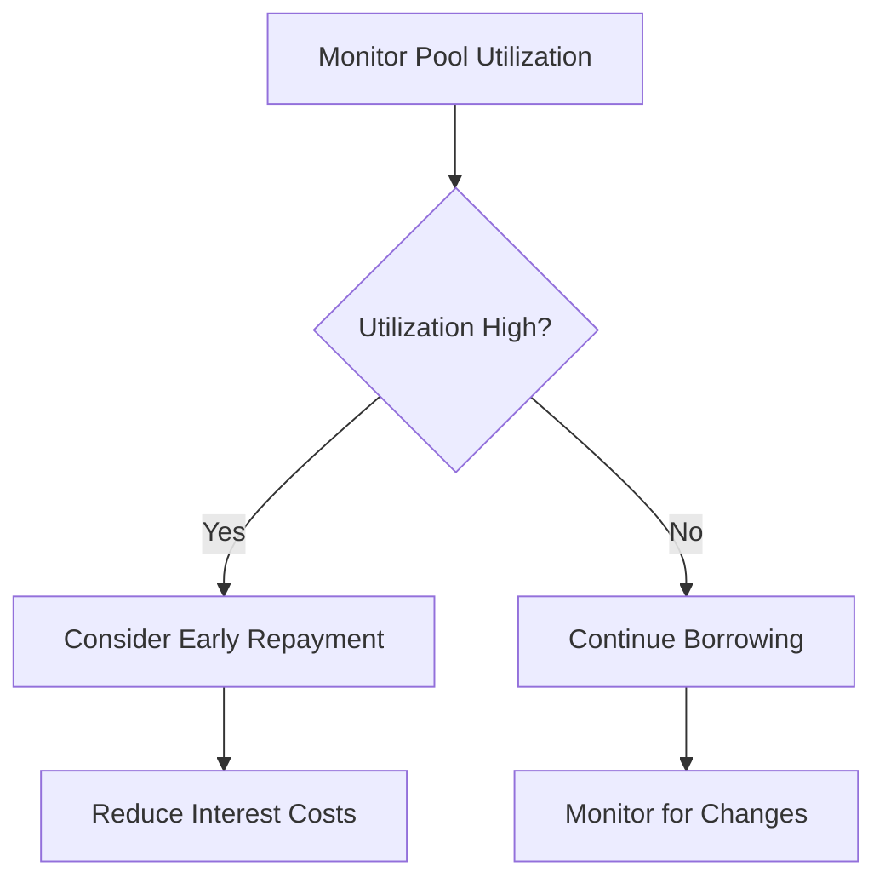

# Safety Guidelines

Essential safety practices for using InfraFi Protocol securely and effectively.


**Critical**: Always follow these safety guidelines to protect your assets and avoid liquidation risks.


## 🔒 Wallet Security

### Fundamental Practices

#### **Seed Phrase Protection**
- ✅ **Never share** your seed phrase with anyone
- ✅ **Store offline** in secure, physical locations  
- ✅ **Multiple backups** in different secure locations
- ✅ **Test recovery** periodically to ensure access

#### **Transaction Verification**
- ✅ **Verify contract addresses** before every transaction
- ✅ **Double-check amounts** and parameters
- ✅ **Review gas fees** for reasonableness
- ✅ **Confirm network** (OORT testnet for testing)

#### **Wallet Hygiene**
```
✅ DO:
- Use hardware wallets for large amounts
- Keep software updated
- Use strong, unique passwords
- Enable all available security features

❌ DON'T:
- Use wallets on public computers
- Store private keys digitally
- Share wallet access with others
- Ignore security warnings
```

## 🏗️ Node Safety

### Infrastructure Protection

#### **Node Security**
- 🔐 **Secure Access**: Use strong authentication for node management
- 🔄 **Regular Updates**: Keep node software current
- 📊 **Monitor Performance**: Track uptime and earnings
- 🔍 **Backup Critical Data**: Maintain copies of important configurations

#### **Ownership Verification**
Before depositing nodes:
1. **Confirm ownership** on OORT blockchain explorer
2. **Verify node status** and operational history
3. **Check earning history** and performance metrics
4. **Ensure exclusive control** - you must be sole owner

### Node Management During Lending

#### **Operational Continuity**
- ✅ **Maintain Operations**: Keep nodes running normally
- ✅ **Monitor Health**: Regular performance checks
- ✅ **Address Issues**: Fix problems promptly to maintain value
- ✅ **Stay Informed**: Follow network updates and changes


**Important**: While your nodes are collateral, you must continue operating them normally. Poor performance can affect collateral value and increase liquidation risk.


## 💰 Financial Safety

### Risk Management

#### **Loan-to-Value (LTV) Management**
```
Risk Levels:
🟢 Safe: 0-50% LTV
🟡 Moderate: 50-70% LTV  
🟠 Risky: 70-80% LTV
🔴 Dangerous: 80%+ LTV (liquidation risk)
```

#### **Best Practices**
- 📊 **Start Conservative**: Begin with low LTV ratios (30-50%)
- 📈 **Monitor Closely**: Check LTV regularly, especially during market volatility
- 💰 **Keep Reserves**: Maintain WOORT for repayment and gas fees
- ⚠️ **Set Alerts**: Use tools to warn of approaching liquidation levels

### Interest Rate Planning

#### **Rate Understanding**
- **Base Rate**: 3% APY minimum cost
- **Utilization Impact**: Rates increase with pool utilization
- **Compounding**: Interest accrues per block (approximately every 3 seconds)
- **Payment Flexibility**: Partial repayments allowed anytime

#### **Cost Management**


## ⚡ Liquidation Prevention

### Understanding Liquidation

#### **Liquidation Triggers**
- **Primary**: LTV exceeds 80% threshold
- **Secondary**: Node value decline due to poor performance
- **Market**: Token price volatility affecting ratios

#### **Warning Signs**
- 🚨 **LTV above 75%**: Approaching danger zone
- 📉 **Node performance decline**: Reduced earning capacity
- 💹 **Market volatility**: Price swings affecting ratios
- ⏰ **High utilization periods**: Rising interest rates

### Prevention Strategies

#### **Proactive Management**
1. **Add Collateral**: Deposit additional nodes to reduce LTV
2. **Partial Repayment**: Reduce debt to improve health ratio
3. **Performance Optimization**: Maintain node operations and uptime
4. **Market Awareness**: Monitor token prices and network conditions

#### **Emergency Procedures**
```
If LTV reaches 78%:
1. IMMEDIATE: Check available WOORT balance
2. ASSESS: Can you repay enough to reduce LTV below 70%?
3. ACTION: Execute repayment or add collateral within 24 hours
4. MONITOR: Verify LTV improvement and continue watching
```

## 🧪 Testnet-Specific Safety

### Testnet Environment


**Remember**: Current deployment is on OORT testnet for testing only. These guidelines apply to testnet usage and future mainnet operations.


#### **Testnet Best Practices**
- ✅ **Use Only Testnet Assets**: Never deposit mainnet nodes or tokens
- ✅ **Expect Bugs**: Report issues but don't rely on perfect functionality
- ✅ **Learn Without Risk**: Practice all operations safely
- ✅ **Help Community**: Share findings and help others learn

#### **Testnet Limitations**
- 🔄 **Resets Possible**: Testnet may be reset during development
- ⚠️ **No Real Value**: Testnet tokens have no monetary value
- 🐛 **Development Version**: Features may change before mainnet
- 📊 **Test Data**: Performance metrics may not reflect mainnet conditions

## 🚨 Emergency Procedures

### Critical Situations

#### **Approaching Liquidation**
```
EMERGENCY CHECKLIST:
□ Check current LTV ratio immediately
□ Calculate minimum repayment needed
□ Verify WOORT token balance for repayment
□ Execute repayment transaction with high gas
□ Confirm LTV reduction below 75%
□ Monitor for 24 hours to ensure stability
```

#### **Technical Issues**
- **Transaction Fails**: Check gas settings and network status
- **Wallet Problems**: Try different browser or wallet reset
- **Node Issues**: Verify node operational status
- **Contract Problems**: Check for protocol updates or maintenance

### Getting Help

#### **Emergency Support**
- 🆘 **Discord #emergency**: Immediate community assistance
- 🐛 **GitHub Issues**: Technical problems and bug reports
- 📧 **Direct Contact**: Critical issues requiring team attention

#### **Self-Help Resources**
- 📚 **[Troubleshooting Guide](../guides/position-management.md#troubleshooting)**
- ❓ **[FAQ](../resources/faq.md)**: Common issues and solutions
- 🔍 **[Protocol Status](https://status.infrafi.com)**: Current system health

## 📋 Safety Checklist

### Before Each Transaction

#### **Pre-Transaction Verification**
- [ ] **Contract Address**: Verified against official documentation
- [ ] **Network**: Correct network selected (OORT testnet)
- [ ] **Gas Fee**: Reasonable and affordable
- [ ] **Amount**: Double-checked for accuracy
- [ ] **Wallet Balance**: Sufficient for transaction and future needs

### Regular Monitoring

#### **Daily Checks** (for active positions)
- [ ] **LTV Ratio**: Within safe range (below 70%)
- [ ] **Node Status**: Operational and earning normally
- [ ] **Interest Accrual**: Tracking debt growth
- [ ] **Market Conditions**: Aware of price movements

#### **Weekly Reviews**
- [ ] **Performance Analysis**: Node earning trends
- [ ] **Risk Assessment**: Overall position health
- [ ] **Strategy Adjustment**: Optimization opportunities
- [ ] **Security Update**: Wallet and system maintenance

## 🎯 Best Practices Summary

### Golden Rules
1. **🏦 Never risk more than you can afford to lose**
2. **📊 Keep LTV below 70% for safety**
3. **🔍 Monitor positions regularly**
4. **💰 Maintain reserves for emergencies**
5. **🛡️ Prioritize security over convenience**

### Success Strategies
- **Start Small**: Begin with modest amounts to learn
- **Stay Informed**: Follow protocol updates and community discussions
- **Plan Ahead**: Have repayment strategies before borrowing
- **Be Conservative**: Err on the side of caution, especially initially

---


**Remember**: These safety guidelines are designed to help you use InfraFi Protocol securely and successfully. Following them will help you avoid common pitfalls and maximize your experience.


## What's Next?

Now that you understand the safety principles:

- **[Quick Start Guide](quickstart.md)** - Apply these guidelines in practice
- **[Position Management](../guides/position-management.md)** - Advanced risk management techniques
- **[FAQ](../resources/faq.md)** - Common safety questions answered

---

*Safety first! When in doubt, ask for help in our community channels.*
