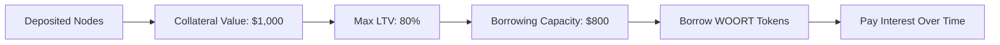

# Borrowing Tokens

Complete guide to borrowing WOORT tokens against your deposited DePIN nodes.


**Prerequisites**: You must have [deposited nodes](depositing-nodes.md) as collateral before you can borrow.


## Overview

Once you have deposited nodes as collateral, you can borrow WOORT tokens up to your loan-to-value (LTV) limit. The borrowed tokens can be used for any purpose while your nodes continue earning rewards.

### How Borrowing Works



## Before You Start

### ✅ **Requirements**

#### **Collateral Status**
- ✅ **Nodes Deposited**: At least one node successfully deposited
- ✅ **Positive Value**: Your nodes have verified collateral value
- ✅ **Active Status**: Nodes are operational and earning

#### **Token Balances**
- 💰 **OORT**: For transaction gas fees (minimum 0.01 OORT)
- 📊 **Available Capacity**: Unused borrowing capacity

### 🔍 **Check Your Position**

#### **View Collateral Status**
1. Navigate to InfraFi dashboard
2. Check "Your Position" section
3. Verify collateral details:

| Metric | Example | Status |
|--------|---------|--------|
| **Total Collateral** | $1,000 | ✅ Active |
| **Current Debt** | $0 | ✅ No existing loans |
| **Available to Borrow** | $800 | ✅ 80% LTV available |
| **Current LTV** | 0% | ✅ Safe to borrow |

## Understanding Interest Rates

### Jump Rate Model

InfraFi uses dynamic interest rates based on pool utilization:

#### **Rate Components**
- **Base Rate**: 3% APY (minimum cost)
- **Utilization Rate**: Current pool usage percentage
- **Jump Rate**: Additional rate above 80% utilization

#### **Current Rates Example**
| Pool Utilization | Interest Rate | Cost on $1,000/year |
|------------------|---------------|---------------------|
| 20% | 4.6% APY | $46 |
| 50% | 7.0% APY | $70 |
| 80% | 9.4% APY | $94 |
| 90% | 14.4% APY | $144 |


**Rate Updates**: Interest rates update in real-time based on supply and demand. Check current rates before borrowing.


### Interest Calculation

#### **Per-Block Accrual**
- **Frequency**: Interest compounds every block (~3 seconds on OORT)
- **Formula**: `newDebt = oldDebt × (1 + blockRate)`
- **Transparency**: All calculations are on-chain and verifiable

## Step-by-Step Borrowing Process

### Step 1: Access Borrowing Interface

#### **Navigate to Borrow**
1. Open InfraFi Protocol app
2. Ensure wallet connected to OORT testnet
3. Click "Borrow" in main navigation
4. Verify you see your collateral information

#### **Interface Elements**
You should see:
- 📊 **Collateral Summary**: Total value and health
- 💰 **Available to Borrow**: Maximum borrowing capacity
- 📈 **Current Rate**: Real-time interest rate
- ⚡ **Gas Estimate**: Transaction cost preview

### Step 2: Enter Borrowing Amount

#### **Amount Selection**
1. **Enter Amount**: Specify WOORT tokens to borrow
   - Use decimal format (e.g., 100.5 WOORT)
   - Stay within your borrowing limit
   - Consider leaving safety margin

2. **Validation Checks**:
   - ✅ Amount within borrowing capacity
   - ✅ Sufficient gas for transaction
   - ✅ Results in safe LTV ratio

#### **Smart Calculations**
The interface automatically shows:
- **New LTV Ratio**: Your loan-to-value after borrowing
- **Monthly Interest**: Estimated monthly cost
- **Annual Cost**: Total yearly interest expense
- **Health Status**: Risk level assessment

### Step 3: Review Loan Terms

#### **Loan Summary**
Before confirming, review:

| Detail | Example | Verify |
|--------|---------|---------|
| **Borrow Amount** | 500 WOORT | ✅ Correct amount |
| **Current Rate** | 7.0% APY | ✅ Acceptable rate |
| **New LTV** | 50% | ✅ Safe ratio |
| **Monthly Interest** | ~2.9 WOORT | ✅ Affordable cost |
| **Gas Fee** | 0.003 OORT | ✅ Reasonable cost |

#### **Risk Assessment**
- 🟢 **Safe (0-50% LTV)**: Low liquidation risk
- 🟡 **Moderate (50-70% LTV)**: Monitor carefully
- 🟠 **Risky (70-80% LTV)**: High vigilance required


**Stay Conservative**: Consider borrowing less than your maximum capacity to maintain a safety buffer against market volatility.


### Step 4: Execute Borrowing Transaction

#### **Transaction Confirmation**
1. Click "Borrow Tokens" button
2. Review transaction in wallet popup
3. Verify contract address matches InfraFi vault
4. Confirm gas settings are acceptable
5. Submit transaction

#### **Transaction Details**
```javascript
// Transaction calls:
Contract: 0x74f68Eec49DFAd34E22f3f6F3e38d4d92D8ab676
Function: borrow(uint256 amount)
Parameters:
  - amount: 500000000000000000000 // 500 WOORT (18 decimals)
```

### Step 5: Confirm Success

#### **Transaction Monitoring**
After submitting:
1. **Pending**: Transaction in mempool
2. **Mining**: Being included in block  
3. **Confirmed**: Successfully executed
4. **Tokens Received**: WOORT added to your wallet

#### **Success Verification**
✅ **WOORT Balance**: Check increased WOORT balance  
✅ **Debt Position**: Verify debt recorded in InfraFi  
✅ **LTV Ratio**: Confirm new loan-to-value ratio  
✅ **Interest Accrual**: Debt begins accumulating interest

## After Borrowing

### Position Management

#### **Monitor Your Loan**
Key metrics to watch:
- 📊 **LTV Ratio**: Keep below 70% for safety
- 💰 **Interest Accrual**: Track growing debt
- 📈 **Collateral Value**: Monitor node performance  
- ⚠️ **Health Status**: Watch for liquidation risk

#### **Regular Checks**
- **Daily**: LTV ratio and health status
- **Weekly**: Interest accumulation and costs
- **Monthly**: Overall position performance
- **As Needed**: Response to market volatility

### Using Borrowed Tokens

#### **Recommended Uses**
- 🏗️ **Infrastructure Expansion**: Buy additional DePIN nodes
- 💰 **Working Capital**: Fund operational expenses
- 🔄 **Diversification**: Invest in other opportunities
- 📊 **Yield Strategies**: Participate in other DeFi protocols

#### **Risk Management**
- ✅ **Keep Reserves**: Maintain WOORT for repayment
- ✅ **Monitor Markets**: Watch token price movements
- ✅ **Stay Liquid**: Ensure ability to repay if needed
- ✅ **Avoid Over-Leverage**: Don't borrow maximum capacity

## Interest and Repayment

### Interest Accrual

#### **How Interest Works**
- 🕐 **Real-Time**: Interest compounds every block
- 📊 **Variable Rate**: Changes with pool utilization
- 💰 **Principal + Interest**: Total debt grows over time
- 🔄 **Continuous**: No payment due dates or penalties

#### **Interest Calculation Example**
```
Starting Loan: 500 WOORT at 7% APY
After 1 Month: ~502.9 WOORT total debt
After 1 Year: ~535 WOORT total debt
```

### Repayment Options

#### **Flexible Repayment**
- ✅ **Anytime**: Repay any amount at any time
- ✅ **Partial**: Interest-only or partial principal payments
- ✅ **Full**: Complete loan repayment
- ✅ **No Penalties**: No prepayment fees

#### **Repayment Process**
1. **Check Debt**: View current total owed
2. **Approve Tokens**: Allow vault to spend your WOORT
3. **Repay Amount**: Submit repayment transaction
4. **Verify**: Confirm debt reduction

## Risk Management

### Liquidation Prevention

#### **LTV Monitoring**
- 🟢 **Target**: Keep LTV below 60%
- 🟡 **Warning**: Monitor closely above 70%
- 🔴 **Danger**: Risk of liquidation above 78%

#### **Protection Strategies**
- **Add Collateral**: Deposit additional nodes
- **Partial Repayment**: Reduce debt burden
- **Monitor Performance**: Keep nodes operating optimally
- **Market Awareness**: Watch for price volatility

### Emergency Procedures

#### **High LTV Situation**
If your LTV approaches 75%:

1. **Immediate Assessment**:
   - Check current LTV ratio
   - Calculate required repayment
   - Verify WOORT balance

2. **Take Action**:
   - Repay enough to reduce LTV below 70%
   - Or deposit additional collateral
   - Monitor for 24 hours to ensure stability

## Common Issues & Troubleshooting

### Transaction Failures

#### **"Insufficient collateral"**
**Cause**: Trying to borrow more than LTV limit allows  
**Solutions**:
- Check your available borrowing capacity
- Try a smaller amount
- Ensure collateral value is current

#### **"Borrow amount is zero"**
**Cause**: Invalid amount entered  
**Solutions**:
- Enter a positive number greater than 0
- Use decimal format (e.g., 100.5)
- Check for UI input errors

#### **"Token transfer failed"**
**Cause**: Contract or balance issues  
**Solutions**:
- Verify contract has sufficient WOORT to lend
- Check your gas balance
- Try again during less congested periods

### Rate and Calculation Issues

#### **"Interest rate seems high"**
**Cause**: High pool utilization increases rates  
**Solutions**:
- Check pool utilization percentage
- Consider waiting for lower utilization
- Factor higher rates into borrowing decision

#### **"Calculations don't match"**
**Cause**: Rates update in real-time  
**Solutions**:
- Refresh page to get latest rates
- Expect small variations due to block updates
- Use estimates rather than exact calculations

## Best Practices

### Borrowing Strategy

#### **Conservative Approach**
- 📊 **Start Small**: Begin with 30-50% LTV
- 🛡️ **Safety Buffer**: Leave room for volatility
- 📈 **Gradual Increase**: Build up borrowing over time
- 💰 **Maintain Reserves**: Keep funds for repayment

#### **Advanced Strategies**
- 🔄 **Rate Timing**: Borrow during low utilization
- 📊 **Position Sizing**: Match borrowing to specific needs
- 🎯 **Diversification**: Spread risk across multiple positions
- 📈 **Yield Optimization**: Use borrowed funds productively

### Financial Management

#### **Cost Optimization**
- 📊 **Rate Shopping**: Monitor rates before borrowing
- ⏰ **Timing**: Avoid high utilization periods
- 💰 **Early Repayment**: Pay down when rates spike
- 🔄 **Refinancing**: Consider alternatives if available

## What's Next?

After successful borrowing:

### Immediate Actions
- **[Monitor Position](position-management.md)** - Track health and performance
- **[Plan Repayment](repaying.md)** - Develop repayment strategy
- **[Risk Management](../getting-started/safety-guidelines.md)** - Follow safety guidelines

### Advanced Features
- **Multiple Positions**: Manage complex borrowing strategies
- **Yield Optimization**: Maximize returns on borrowed capital
- **Position Trading**: Advanced position management techniques

---


**Congratulations!** You've successfully borrowed tokens against your DePIN infrastructure. Your nodes continue earning while providing you with liquid capital.


## Need Help?

**Community Support:**
- 💬 **Discord**: Real-time help in #support channel
- 📚 **Documentation**: Check [FAQ](../resources/faq.md) for common issues
- 🐛 **GitHub**: Report technical problems

**Emergency Support:**
- 🆘 **Discord #emergency**: Urgent liquidation risk issues
- 📧 **Direct Contact**: Critical financial situations

---

*Remember: Borrowing unlocks the liquidity of your infrastructure investments while keeping your devices productive. Use this power responsibly!*
