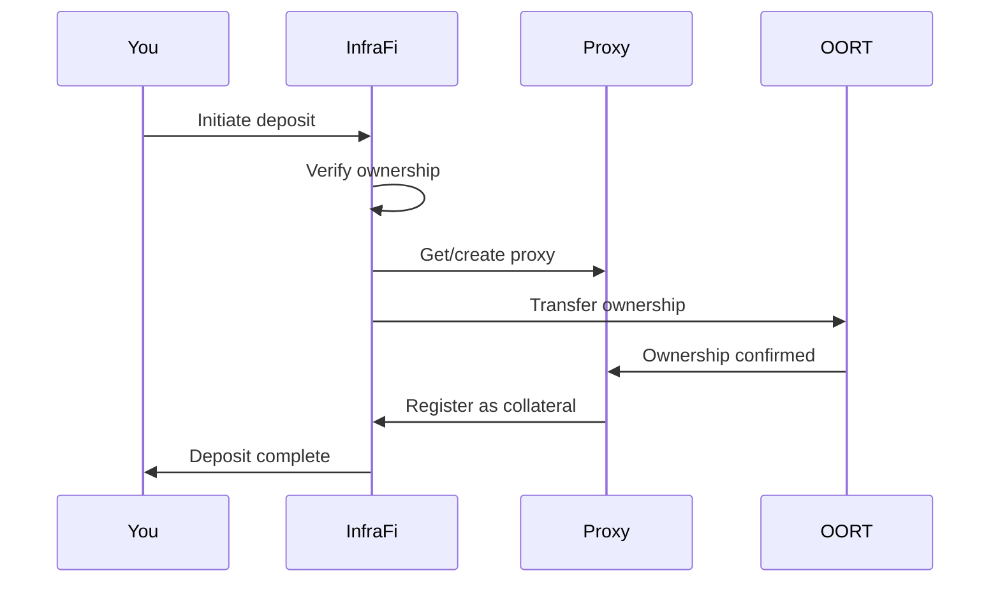

# Depositing Nodes

Complete guide to depositing your DePIN devices as collateral in InfraFi Protocol.


**Prerequisites**: Complete [Prerequisites](../getting-started/prerequisites.md) setup before following this guide.


## Overview

Depositing your nodes is the first step to using InfraFi Protocol. This process transfers ownership to InfraFi's secure proxy system while you maintain full operational control and earning rights.

### What Happens During Deposit



**Key Points:**
- ✅ Your node continues operating normally
- ✅ All rewards continue flowing to you
- ✅ Ownership is temporarily held by secure proxy
- ✅ You can withdraw nodes after repaying any debt

## Before You Start

### ✅ **Required Information**

#### **Node Details**
- **Node ID**: Your OORT node identifier
- **Node Type**: `1` for OORT protocol
- **Current Owner**: Must be your wallet address

#### **Verify Node Ownership**
1. Visit [OORT Network Explorer](https://mainnet-scan.oortech.com)
2. Search for your node ID
3. Confirm your wallet is listed as owner
4. Check node status and earnings


**Important**: You can only deposit nodes you currently own. The transaction will fail if ownership cannot be verified.


### 💰 **Check Balances**

#### **Required Tokens**
- **OORT**: For transaction gas fees (minimum 0.01 OORT)
- **Node Value**: Your node should have staked OORT or earned rewards

#### **Balance Verification**
```javascript
// Check your OORT balance for gas
await web3.eth.getBalance(yourAddress)

// Check node value (example for node ID 123456)
await nodeContract.methods.nodeDataInfo("0x...nodeAddress").call()
```

## Step-by-Step Process

### Step 1: Connect to InfraFi

#### **Access the Application**
1. Navigate to InfraFi Protocol app
2. Ensure you're on OORT testnet
3. Click "Connect Wallet"
4. Select your wallet provider
5. Approve connection

#### **Network Verification**
Confirm you see:
- ✅ **Network**: OORT Testnet (Chain ID: 970)
- ✅ **Balance**: Your OORT balance displayed
- ✅ **Status**: "Connected" indicator

### Step 2: Navigate to Deposit

#### **Access Deposit Interface**
1. Click "Deposit" in main navigation
2. Select "Deposit Nodes" option
3. Verify you're on the node deposit page

#### **Interface Elements**
You should see:
- 📝 **Node ID input**: Where to enter your node identifier
- 🔧 **Node Type selector**: Dropdown to select protocol (OORT = 1)
- 💰 **Value display**: Will show estimated collateral value
- ⚡ **Gas estimate**: Expected transaction cost

### Step 3: Enter Node Information

#### **Input Node Details**
1. **Node ID**: Enter your OORT node ID
   - Example: `123456789`
   - Use only numeric characters
   - Verify ID matches your records

2. **Node Type**: Select "OORT" or enter `1`
   - OORT protocol type is `1`
   - Other protocols will have different numbers

#### **Information Validation**
The interface will automatically:
- ✅ Verify node exists on OORT network
- ✅ Confirm your ownership
- ✅ Calculate current node value
- ✅ Show estimated collateral capacity

### Step 4: Review Deposit Details

#### **Confirmation Screen**
Before confirming, verify:

| Detail | Example | Verify |
|--------|---------|---------|
| **Node ID** | 123456789 | ✅ Matches your node |
| **Node Type** | 1 (OORT) | ✅ Correct protocol |
| **Current Value** | 1,000 WOORT | ✅ Reasonable estimate |
| **Collateral Value** | 800 WOORT | ✅ 80% of node value |
| **Gas Fee** | 0.005 OORT | ✅ Acceptable cost |

#### **Pre-Transaction Checks**
- ✅ **Ownership**: You are the current node owner
- ✅ **Status**: Node is active and earning
- ✅ **Value**: Collateral estimate looks reasonable
- ✅ **Gas**: You have sufficient OORT for fees


**Ready to Proceed**: If all details look correct, you can proceed to transaction confirmation.


### Step 5: Execute Transaction

#### **Confirm Transaction**
1. Click "Deposit Node" button
2. Review transaction in your wallet
3. Verify contract address matches official InfraFi vault
4. Confirm gas price is reasonable
5. Submit transaction

#### **Transaction Details**
```javascript
// Transaction will call:
Contract: 0x74f68Eec49DFAd34E22f3f6F3e38d4d92D8ab676
Function: depositNodes([nodeId], [nodeType])
Parameters:
  - nodeIds: [123456789]
  - nodeTypes: [1]
```

#### **Wallet Confirmation**
Your wallet will show:
- 🏦 **To**: InfraFi Vault contract address
- ⛽ **Gas**: Estimated gas fee (typically 200,000-500,000 gas)
- 📊 **Data**: Encoded function call with your node details

### Step 6: Monitor Transaction

#### **Transaction Status**
After submitting:
1. **Pending**: Transaction submitted to network
2. **Mining**: Being included in block
3. **Confirmed**: Successfully executed
4. **Failed**: Error occurred (see troubleshooting)

#### **Confirmation Time**
- **OORT Network**: ~3-9 seconds (1-3 blocks)
- **Busy Periods**: May take longer
- **Gas Too Low**: Will eventually fail if gas price insufficient

#### **Success Indicators**
✅ **Transaction Hash**: Unique identifier for your transaction  
✅ **Block Number**: Block containing your transaction  
✅ **Status**: "Success" on block explorer  
✅ **Events**: Deposit event emitted by contract

## After Successful Deposit

### Verify Deposit

#### **Check InfraFi Interface**
You should now see:
- 📊 **Deposited Nodes**: Your node listed in dashboard
- 💰 **Collateral Value**: Total collateral available
- 🏦 **Borrowing Capacity**: Amount you can borrow (80% of value)
- 📈 **Health Ratio**: N/A (no debt yet)

#### **Verify on Blockchain**
1. **Node Ownership**: Check OORT explorer - should show proxy contract as owner
2. **InfraFi Records**: Your node should appear in vault contract
3. **Earning Continuation**: Node rewards should continue flowing to you

### Node Management

#### **Operational Continuity**
- ✅ **Keep Running**: Your node must continue operating normally
- ✅ **Monitor Performance**: Poor performance affects collateral value
- ✅ **Maintain Uptime**: Downtime reduces earning potential
- ✅ **Network Updates**: Stay current with OORT network requirements

#### **Earnings Flow**
- 💰 **Direct to You**: All node rewards continue to your wallet
- 📊 **Value Tracking**: InfraFi tracks total node value including new earnings
- 🔄 **Real-Time Updates**: Collateral value updates as node earns

## Common Issues & Troubleshooting

### Transaction Failures

#### **"Node not owned by user"**
**Cause**: Ownership verification failed
**Solutions:**
- Verify you own the node on OORT explorer
- Check node ID is entered correctly
- Ensure node is active and registered
- Confirm wallet address matches node owner

#### **"Insufficient gas"**
**Cause**: Gas limit too low or gas price too low
**Solutions:**
- Increase gas limit to 500,000+
- Use higher gas price during network congestion
- Check OORT balance sufficient for fees
- Try again during less busy periods

#### **"Transaction failed"**
**Cause**: Various potential issues
**Solutions:**
- Check node is not already deposited elsewhere
- Verify network connection stable
- Ensure correct network (OORT testnet)
- Contact support with transaction hash

### Interface Issues

#### **"Node value not loading"**
**Cause**: Network connection or data fetching issue
**Solutions:**
- Refresh page and reconnect wallet
- Check OORT network RPC connection
- Try different browser or disable ad blockers
- Wait and retry - may be temporary network issue

#### **"Wallet not connecting"**
**Cause**: Wallet or network configuration issue
**Solutions:**
- Refresh page and try reconnecting
- Check wallet is unlocked
- Verify OORT testnet is added to wallet
- Try different wallet or browser

## Best Practices

### Security

#### **Transaction Safety**
- ✅ **Verify Contract**: Always confirm contract address matches official documentation
- ✅ **Start Small**: Test with one node before depositing multiple
- ✅ **Double-Check Details**: Verify node ID and type before confirming
- ✅ **Save Records**: Keep transaction hashes for reference

#### **Ongoing Monitoring**
- 📊 **Regular Checks**: Monitor node performance and value
- ⚠️ **Health Alerts**: Watch for system health warnings
- 🔄 **Update Tracking**: Stay informed about protocol updates
- 💰 **Earnings Verification**: Confirm rewards continue flowing

### Optimization

#### **Timing Strategy**
- 🕐 **Network Congestion**: Avoid peak usage times for lower gas fees
- 📊 **Value Tracking**: Deposit when node value is stable or growing
- ⚡ **Gas Optimization**: Use appropriate gas price for urgency level

#### **Multi-Node Management**
- 🔢 **Batch Deposits**: Deposit multiple nodes in single transaction for gas savings
- 📋 **Organization**: Keep clear records of all deposited nodes
- 🎯 **Strategic Selection**: Choose highest-value nodes for maximum collateral

## What's Next?

After successfully depositing your nodes:

### Immediate Next Steps
1. **[Borrowing Tokens](borrowing.md)** - Access liquidity against your collateral
2. **[Position Management](position-management.md)** - Monitor and optimize your position
3. **[Safety Guidelines](../getting-started/safety-guidelines.md)** - Review ongoing safety practices

### Advanced Features
- **Multiple Nodes**: Deposit additional nodes to increase collateral
- **Value Optimization**: Strategies for maximizing node value
- **Risk Management**: Advanced techniques for position safety

---


**Congratulations!** You've successfully deposited your first node as collateral. You can now borrow tokens while your device continues earning rewards.


## Need Help?

**Community Support:**
- 💬 **Discord**: Real-time help in #support channel
- 📚 **Documentation**: Check [FAQ](../resources/faq.md) for common issues
- 🐛 **GitHub**: Report technical issues

**Emergency Issues:**
- 🆘 **Discord #emergency**: Urgent problems requiring immediate attention
- 📧 **Direct Contact**: Critical security or financial issues

---

*Remember: Your node continues earning rewards while serving as collateral. This is the key innovation that makes InfraFi different from traditional lending!*
