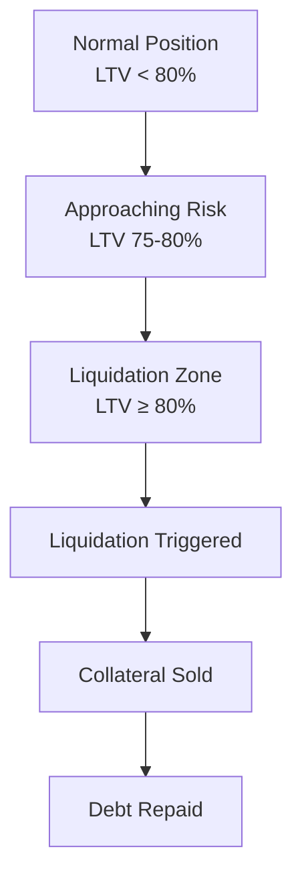

# Understanding Liquidations

Comprehensive guide to liquidation risks, prevention, and recovery in InfraFi Protocol.


**Critical Information**: Liquidation results in forced sale of your collateral. Understanding and preventing liquidations is essential for safe DePIN lending.


## What is Liquidation?

Liquidation is InfraFi's safety mechanism that automatically sells borrower collateral when loan positions become too risky, protecting both the protocol and lenders from bad debt.

### When Liquidation Occurs

Liquidation is triggered when your **Loan-to-Value (LTV) ratio exceeds the liquidation threshold**:



### Liquidation Thresholds

| Network | Liquidation Threshold | Safety Buffer |
|---------|----------------------|---------------|
| **OORT Testnet** | 80% LTV | Keep below 75% |
| **OORT Mainnet** (planned) | 60% LTV | Keep below 50% |

## How Liquidation Works

### Liquidation Process

When your LTV exceeds the threshold:

1. **Detection**: Protocol identifies unhealthy position
2. **Liquidation Call**: Anyone can trigger liquidation
3. **Collateral Sale**: Nodes sold to repay debt
4. **Debt Settlement**: Loan balance reduced/eliminated
5. **Liquidation Bonus**: Liquidator receives incentive
6. **Remaining Collateral**: Any surplus returned to borrower

### Liquidation Mechanics

#### **Partial vs Full Liquidation**
- **Partial**: Only enough collateral sold to restore health
- **Full**: Entire position liquidated if severely undercollateralized
- **Target**: Restore LTV to safe level (typically 75% of threshold)

#### **Liquidation Bonus**
Liquidators receive bonus for performing liquidations:
- **Testnet**: 5% bonus on liquidated amount
- **Mainnet**: 10% bonus (planned conservative approach)
- **Purpose**: Incentivize timely liquidation execution

### Mathematical Example

```
Scenario: Liquidation at 80% LTV
- Collateral Value: $1,000 (1 OORT node)
- Debt Amount: $800 (800 WOORT)
- LTV Ratio: 80% (liquidation triggered)

Liquidation Execution:
- Collateral Sold: ~$842 worth (enough to repay debt + bonus)
- Debt Repaid: $800
- Liquidation Bonus: $42 (5% of $842)
- Borrower Receives: $158 remaining collateral value
```

## Liquidation Triggers

### Primary Triggers

#### **1. LTV Threshold Breach**
Most common cause:
- **Interest Accrual**: Debt grows due to compound interest
- **Collateral Decline**: Node value decreases
- **Market Volatility**: Token price movements
- **Performance Issues**: Poor node operation affecting value

#### **2. Collateral Value Drop**
Node value can decline due to:
- 🔧 **Poor Performance**: Reduced uptime or earnings
- 📉 **Network Issues**: Protocol problems affecting rewards
- 💰 **Token Price**: Underlying token depreciation
- ⚡ **Hardware Problems**: Device failures or issues

#### **3. Debt Growth**
Accelerated by:
- 📈 **High Interest Rates**: During peak utilization periods
- ⏰ **Time Passage**: Compound interest accumulation
- 🔄 **Rate Spikes**: Jump rate model activation
- 💹 **Market Conditions**: Volatility-driven rate increases

### Warning Signs

#### **Early Warning Indicators**
- 📊 **LTV above 70%**: Entering caution zone
- 📈 **Rising Interest Rates**: Increasing borrowing costs
- 📉 **Declining Node Performance**: Reduced earning capacity
- 💹 **Market Volatility**: Unstable collateral values

#### **Immediate Danger Signals**
- 🚨 **LTV above 75%**: High risk territory
- 🔴 **LTV above 78%**: Liquidation imminent
- ⚠️ **Performance Alerts**: Node operational issues
- 📉 **Value Drops**: Significant collateral depreciation

## Liquidation Prevention

### Proactive Monitoring

#### **Daily Health Checks**
Essential monitoring activities:
- 📊 **LTV Tracking**: Check ratio daily
- 🔧 **Node Status**: Verify operational health
- 💰 **Interest Accrual**: Monitor debt growth
- 📈 **Market Conditions**: Watch for volatility

#### **Automated Alerts**
Set up notifications for:
- 📱 **LTV Warnings**: 70%, 75%, 78% thresholds
- 🔔 **Rate Changes**: Interest rate increases
- ⚡ **Node Issues**: Performance problems
- 📊 **Market Movements**: Price volatility alerts

### Prevention Strategies

#### **1. Conservative Borrowing**
- 🎯 **Target LTV**: Stay below 60% for safety
- 💰 **Reserve Buffer**: Keep emergency repayment funds
- 📊 **Gradual Increase**: Build position slowly over time
- ⚖️ **Risk Assessment**: Regular position evaluation

#### **2. Active Management**
- 🔄 **Regular Repayments**: Reduce debt burden periodically
- 📈 **Collateral Addition**: Deposit additional nodes when needed
- 🎯 **Performance Optimization**: Maintain excellent node operation
- 💡 **Strategy Adjustment**: Adapt to changing conditions

#### **3. Emergency Preparedness**
- 💰 **WOORT Reserves**: Maintain repayment capacity
- 📞 **Support Contacts**: Know where to get help quickly
- 🚨 **Action Plans**: Pre-planned liquidation prevention steps
- ⚡ **Quick Response**: Ability to act within hours

## Emergency Liquidation Prevention

### High-Risk Response Protocol

#### **LTV 75-78%: Yellow Alert**
**Immediate Actions (within 24 hours):**
1. 🔍 **Assess Position**: Calculate exact LTV and required action
2. 💰 **Check Resources**: Verify available WOORT and options
3. 📊 **Calculate Solutions**: Determine repayment or collateral needs
4. ⚡ **Execute Action**: Implement solution immediately
5. 📈 **Monitor Result**: Verify LTV reduction

#### **LTV 78%+: Red Alert**
**Emergency Actions (within 6 hours):**
1. 🚨 **Drop Everything**: Focus exclusively on position
2. 💸 **Emergency Repayment**: Use all available WOORT immediately
3. 🤝 **Seek Help**: Contact community for assistance
4. 🔄 **Asset Conversion**: Convert any assets to WOORT
5. 📞 **External Resources**: Use credit/loans if necessary

### Emergency Resources

#### **Quick WOORT Acquisition**
- 🔄 **DEX Trading**: Swap tokens on decentralized exchanges
- 🏪 **CEX Purchase**: Buy from centralized exchanges
- 🤝 **Community**: Request temporary assistance
- 💳 **External Funding**: Credit cards, loans, etc.

#### **Community Support**
- 🆘 **Discord #emergency**: Immediate community assistance
- 🤝 **Lending Pool**: Community members may assist
- 📞 **Direct Messages**: Reach out to experienced users
- 💡 **Strategy Help**: Get advice on best response

## During Liquidation

### If Liquidation Occurs

#### **Immediate Recognition**
Signs you've been liquidated:
- 📉 **Collateral Reduction**: Nodes removed from your position
- 💰 **Debt Reduction**: Outstanding loan decreased
- 🔔 **Transaction Alert**: Liquidation transaction visible
- 📊 **LTV Normalization**: Ratio restored to safe level

#### **Post-Liquidation Assessment**
After liquidation occurs:
1. 📊 **Position Review**: Check remaining collateral and debt
2. 💰 **Loss Calculation**: Determine liquidation cost
3. 🔍 **Cause Analysis**: Understand what triggered liquidation
4. 📈 **Recovery Planning**: Develop path forward

### Liquidation Impact

#### **Financial Consequences**
- 📉 **Collateral Loss**: Portion of nodes sold at market rates
- 💸 **Liquidation Penalty**: 5-10% bonus paid to liquidator
- 🔄 **Position Reduction**: Smaller collateral base
- 📊 **Credit Impact**: Affects borrowing capacity

#### **Emotional Impact**
Liquidation can be stressful:
- 😔 **Disappointment**: Failed position management
- 💭 **Learning Opportunity**: Valuable experience gained
- 🎯 **Future Preparation**: Better risk management
- 🤝 **Community Support**: Others have experienced similar situations

## Post-Liquidation Recovery

### Immediate Steps

#### **Damage Assessment**
- 📊 **Calculate Losses**: Determine total liquidation cost
- 💰 **Remaining Assets**: Inventory what's left
- 📈 **Position Status**: Understand current state
- 🎯 **Recovery Capacity**: Assess ability to rebuild

#### **Emotional Recovery**
- 🧘 **Stay Calm**: Liquidation is a learning experience
- 💭 **Analyze Objectively**: Understand what happened
- 🎯 **Plan Forward**: Focus on future improvements
- 🤝 **Seek Support**: Community can provide encouragement

### Rebuilding Strategy

#### **Conservative Restart**
If returning to DePIN lending:
- 📊 **Lower LTV Targets**: Much more conservative approach
- 💰 **Better Monitoring**: Improved risk management systems
- 🛡️ **Larger Buffers**: Increased safety margins
- 📚 **Enhanced Knowledge**: Apply lessons learned

#### **Alternative Approaches**
Consider other strategies:
- 🔄 **Direct Node Operations**: Focus on pure node operations
- 📈 **Gradual Re-entry**: Slowly build back to lending
- 🎯 **Risk-Free Growth**: Build wealth before leveraging again
- 💡 **Education Focus**: Deepen understanding before returning

## Liquidation for Liquidators

### Becoming a Liquidator

#### **Liquidator Role**
Liquidators help maintain protocol health by:
- 🔍 **Monitoring Positions**: Finding liquidatable positions
- ⚡ **Executing Liquidations**: Triggering liquidation transactions
- 💰 **Earning Bonuses**: Receiving incentive payments
- 🛡️ **Protecting Protocol**: Preventing bad debt accumulation

#### **Requirements**
- 💰 **Capital**: WOORT to repay liquidated debt
- 🔧 **Technical**: Ability to identify and execute liquidations
- ⚡ **Speed**: Quick response to liquidation opportunities
- 📊 **Monitoring**: Systems to track position health

### Liquidation Bots

#### **Automated Liquidation**
Most liquidations performed by:
- 🤖 **Automated Bots**: Constant position monitoring
- ⚡ **Fast Execution**: Immediate liquidation triggering
- 📊 **Efficient Markets**: Competitive liquidation environment
- 💰 **Professional Operations**: Specialized liquidation services

## Risk Scenarios & Case Studies

### Common Liquidation Scenarios

#### **Scenario 1: Interest Rate Spike**
```
Initial: 50% LTV, 5% interest rate
Rate Change: Utilization spike → 15% rate
Result: Accelerated debt growth → liquidation in weeks
Lesson: Monitor rate environments closely
```

#### **Scenario 2: Node Performance Decline**
```
Initial: 60% LTV, stable node performance  
Performance: Hardware issues reduce earnings by 40%
Result: Collateral value drop → immediate liquidation
Lesson: Maintain node infrastructure properly
```

#### **Scenario 3: Market Crash**
```
Initial: 70% LTV during stable markets
Market: OORT token crashes 30% overnight
Result: Collateral value drop → mass liquidation
Lesson: Conservative LTV essential during volatility
```

### Learning from Liquidations

#### **Common Mistakes**
- 📊 **Over-leveraging**: Borrowing too close to maximum
- 🔧 **Poor Monitoring**: Insufficient position oversight
- 💰 **No Reserves**: Lack of emergency funds
- 📈 **Ignoring Warnings**: Not responding to early signals

#### **Success Patterns**
- 🛡️ **Conservative Approach**: Lower LTV targets
- 📊 **Active Monitoring**: Regular health checks
- 💰 **Reserve Maintenance**: Emergency fund availability
- 🎯 **Quick Response**: Fast action on warnings

## Best Practices Summary

### Liquidation Prevention Rules

#### **Golden Rules**
1. 🎯 **Keep LTV below 60%** for maximum safety
2. 💰 **Maintain WOORT reserves** for emergencies
3. 📊 **Monitor daily** for position health
4. 🔧 **Keep nodes operational** and optimized
5. ⚡ **Respond quickly** to warning signals

#### **Advanced Strategies**
- 📈 **Stress Testing**: Model liquidation scenarios
- 🔄 **Regular Rebalancing**: Adjust positions proactively
- 📊 **Risk Budgeting**: Allocate specific risk amounts
- 💡 **Scenario Planning**: Prepare for various market conditions

---


**Prevention is Better Than Cure**: Understanding liquidation helps you avoid it entirely. Most liquidations are preventable with proper risk management.


## Related Resources

**Essential Reading:**
- **[Position Management](position-management.md)** - Ongoing risk management
- **[Safety Guidelines](../getting-started/safety-guidelines.md)** - Comprehensive safety practices  
- **[Repaying Loans](repaying.md)** - Debt management strategies

**Community Support:**
- 🆘 **Discord #emergency**: Immediate liquidation prevention help
- 💬 **Discord #support**: General assistance and advice
- 📚 **FAQ**: [Common questions](../resources/faq.md) about liquidations

---

*Liquidation is a safety mechanism, not a punishment. Learn from it, adapt your strategy, and become a better DePIN lending participant.*
