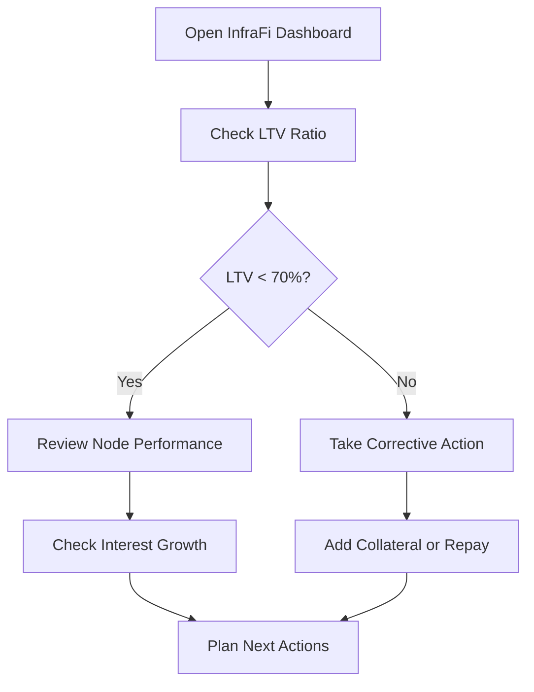

# Managing Your Position

Monitor, optimize, and protect your InfraFi lending position for maximum safety and efficiency.


**Active Management**: Successful DePIN lending requires ongoing position monitoring and occasional adjustments.


## Position Dashboard

### Key Metrics Overview

Your InfraFi dashboard displays critical position information:

| Metric | Description | Healthy Range |
|--------|-------------|---------------|
| **Total Collateral** | Current value of all deposited nodes | Growing/Stable |
| **Total Debt** | Outstanding loan amount (principal + interest) | Manageable |
| **LTV Ratio** | Debt ÷ Collateral Value × 100 | Below 70% |
| **Health Factor** | Collateral ÷ (Debt × 1.25) | Above 1.3 |
| **Available to Borrow** | Additional borrowing capacity | Positive buffer |

### Position Status Indicators

#### **Health Status Colors**
- 🟢 **Healthy (0-60% LTV)**: Low risk, room for growth
- 🟡 **Moderate (60-75% LTV)**: Monitor regularly
- 🟠 **At Risk (75-80% LTV)**: Take action soon
- 🔴 **Dangerous (80%+ LTV)**: Liquidation risk

## Daily Monitoring

### Essential Daily Checks

#### **Morning Review (5 minutes)**
1. **LTV Ratio**: Check overnight changes
2. **Node Performance**: Verify all nodes operational
3. **Interest Accrual**: Review debt growth
4. **Market Conditions**: Check OORT/WOORT prices

#### **Dashboard Walkthrough**

### Automated Monitoring Tools

#### **Set Up Alerts**
Create monitoring systems for:
- 📊 **LTV Alerts**: Notify when approaching 70%
- 📈 **Interest Rate Changes**: Track borrowing cost changes
- 🔧 **Node Performance**: Monitor device uptime/earnings
- 💹 **Price Movements**: Watch OORT token volatility

## Risk Management

### LTV Management Strategy

#### **Target LTV Ranges**
- **Conservative**: 0-40% LTV for maximum safety
- **Balanced**: 40-60% LTV for moderate risk/reward
- **Aggressive**: 60-70% LTV requires active management
- **Dangerous**: Above 70% LTV - immediate attention needed

#### **LTV Optimization Techniques**

**Lowering LTV (Safer Position):**
1. **Partial Repayment**: Reduce debt burden
2. **Add Collateral**: Deposit additional nodes
3. **Improve Performance**: Optimize node operations

**Managing Higher LTV:**
1. **Close Monitoring**: Daily health checks
2. **Reserve Funds**: Maintain WOORT for emergencies
3. **Quick Response Plan**: Pre-planned liquidation prevention

### Collateral Value Optimization

#### **Node Performance Management**
- ✅ **Uptime Monitoring**: Keep nodes operational 24/7
- ✅ **Performance Optimization**: Maintain high earning rates
- ✅ **Network Participation**: Stay current with protocol updates
- ✅ **Hardware Maintenance**: Ensure optimal device performance

#### **Value Enhancement Strategies**
- 🔄 **Reinvest Earnings**: Compound node rewards
- 📈 **Upgrade Hardware**: Improve earning capacity
- 🌐 **Network Expansion**: Add complementary nodes
- 🎯 **Strategic Positioning**: Optimize geographic placement

## Position Adjustments

### Adding Collateral

#### **When to Add Collateral**
- 📊 LTV approaching 70%
- 💹 Market volatility periods
- 🔄 Before increasing borrowing
- 🛡️ As defensive measure

#### **Adding Collateral Process**
1. **Prepare New Nodes**: Ensure ownership and operation
2. **Follow Deposit Process**: Use [Depositing Nodes](depositing-nodes.md) guide
3. **Verify Impact**: Check LTV reduction
4. **Monitor Results**: Confirm improved position health

### Adjusting Debt

#### **Increasing Borrowing**
Before borrowing more:
- ✅ **LTV Check**: Ensure safe ratio maintained
- ✅ **Rate Analysis**: Consider current interest costs
- ✅ **Purpose Assessment**: Validate borrowing need
- ✅ **Repayment Plan**: Have clear repayment strategy

#### **Reducing Debt**
Benefits of debt reduction:
- 📊 **Improved LTV**: Better safety margin
- 💰 **Lower Interest**: Reduced ongoing costs
- 🛡️ **Risk Reduction**: Less liquidation exposure
- 🔄 **Flexibility**: More borrowing capacity available

## Interest Management

### Cost Optimization

#### **Interest Rate Monitoring**
Track rate changes and their impact:
- 📈 **Utilization Tracking**: Monitor pool usage
- 💰 **Cost Calculation**: Estimate monthly/annual costs
- 🔄 **Timing Strategy**: Borrow during low-rate periods
- 📊 **Budget Planning**: Factor rates into financial planning

#### **Payment Strategies**
- **Interest-Only Payments**: Maintain debt level while covering costs
- **Partial Principal**: Gradually reduce debt burden
- **Full Repayment**: Eliminate interest costs entirely
- **Strategic Timing**: Repay during high-rate periods

### Advanced Strategies

#### **Rate Optimization**
- 🕐 **Timing Trades**: Borrow when rates are low
- 🔄 **Position Cycling**: Repay and re-borrow strategically
- 📊 **Utilization Awareness**: Understand pool dynamics
- 💹 **Market Correlation**: Consider broader market conditions

## Emergency Procedures

### High-Risk Situations

#### **LTV Above 75% - Yellow Alert**
**Immediate Actions:**
1. 🔍 **Assess Situation**: Calculate exact LTV
2. 💰 **Check Resources**: Verify repayment capacity
3. 📊 **Calculate Needs**: Determine required action
4. ⚡ **Take Action**: Repay or add collateral within 24 hours

#### **LTV Above 78% - Red Alert**
**Emergency Protocol:**
1. 🚨 **Immediate Response**: Drop everything, focus on position
2. 💸 **Emergency Repayment**: Use all available WOORT
3. 🏗️ **Collateral Addition**: Deposit any available nodes
4. 🆘 **Community Help**: Seek assistance in Discord emergency channel

### Liquidation Prevention

#### **Prevention Checklist**
- [ ] **Daily Monitoring**: Check position health
- [ ] **Reserve Maintenance**: Keep emergency WOORT funds  
- [ ] **Alert Systems**: Set up LTV warnings
- [ ] **Response Plan**: Know exactly what to do in crisis
- [ ] **Community Contact**: Have support channels ready

#### **Emergency Contact List**
- 🆘 **Discord #emergency**: Immediate community help
- 📧 **emergency@infrafi.com**: Direct team contact
- 🐛 **GitHub Issues**: Technical problem reports

## Advanced Position Management

### Multi-Node Strategies

#### **Portfolio Diversification**
- 🌐 **Geographic Spread**: Nodes in different regions
- 🔧 **Hardware Variety**: Different node types and specifications
- 📊 **Performance Mix**: Combine stable and high-growth nodes
- 🎯 **Risk Balancing**: Mix conservative and aggressive positions

#### **Scaling Strategies**
- 📈 **Gradual Growth**: Slowly increase position size
- 🔄 **Reinvestment**: Use borrowed funds to acquire more nodes
- 🎯 **Leverage Management**: Maintain safe aggregate LTV
- 📊 **Performance Tracking**: Monitor portfolio-level metrics

### Yield Optimization

#### **Capital Efficiency**
- 💰 **Productive Use**: Deploy borrowed capital effectively  
- 🔄 **Compounding**: Reinvest returns to grow position
- 📊 **ROI Tracking**: Monitor return on borrowed capital
- ⚖️ **Risk-Reward Balance**: Optimize for your risk tolerance

## Troubleshooting

### Common Issues

#### **Dashboard Not Loading**
**Solutions:**
- Refresh browser and reconnect wallet
- Check network connection and RPC status
- Clear browser cache and cookies
- Try different browser or incognito mode

#### **Incorrect Position Data**
**Solutions:**
- Wait for blockchain sync (may take minutes)
- Refresh page to update data
- Verify wallet connected to correct network
- Check for pending transactions

#### **Transaction Failures**
**Solutions:**
- Increase gas limit for complex operations
- Check sufficient OORT balance for fees
- Verify network congestion levels
- Try again during off-peak hours

### Performance Issues

#### **Slow Updates**
**Causes & Solutions:**
- **Network Congestion**: Wait or increase gas price
- **RPC Issues**: Switch to alternative RPC endpoint
- **Browser Problems**: Clear cache, restart browser
- **Wallet Issues**: Reconnect or restart wallet

#### **Calculation Discrepancies**
**Common Causes:**
- **Real-time Updates**: Values change between blocks
- **Interest Accrual**: Debt grows continuously
- **Price Changes**: Token values fluctuate
- **Rounding**: Small differences in decimal precision

## Best Practices Summary

### Daily Habits
- ✅ **Morning Check**: Review position health (5 minutes)
- ✅ **Node Monitoring**: Ensure operational status
- ✅ **Market Awareness**: Stay informed of major movements
- ✅ **Alert Response**: Act quickly on warnings

### Weekly Reviews
- 📊 **Performance Analysis**: Node earning trends
- 💰 **Cost Assessment**: Interest and maintenance costs
- 🎯 **Strategy Adjustment**: Refine based on results
- 📈 **Growth Planning**: Consider expansion opportunities

### Monthly Optimization
- 📋 **Comprehensive Review**: Full position analysis
- 🔄 **Strategy Refresh**: Update based on market changes
- 💡 **Improvement Opportunities**: Identify optimizations
- 🎯 **Goal Adjustment**: Refine objectives based on performance

---


**Effective position management is the key to successful DePIN lending.** Regular monitoring and proactive adjustments help maximize returns while minimizing risks.


## Related Guides

**Continue your journey:**
- **[Repaying Loans](repaying.md)** - Debt management strategies
- **[Understanding Liquidations](liquidations.md)** - Risk mitigation
- **[Safety Guidelines](../getting-started/safety-guidelines.md)** - Comprehensive risk management

---

*Position management is an ongoing process. Stay engaged, stay informed, and stay safe!*
