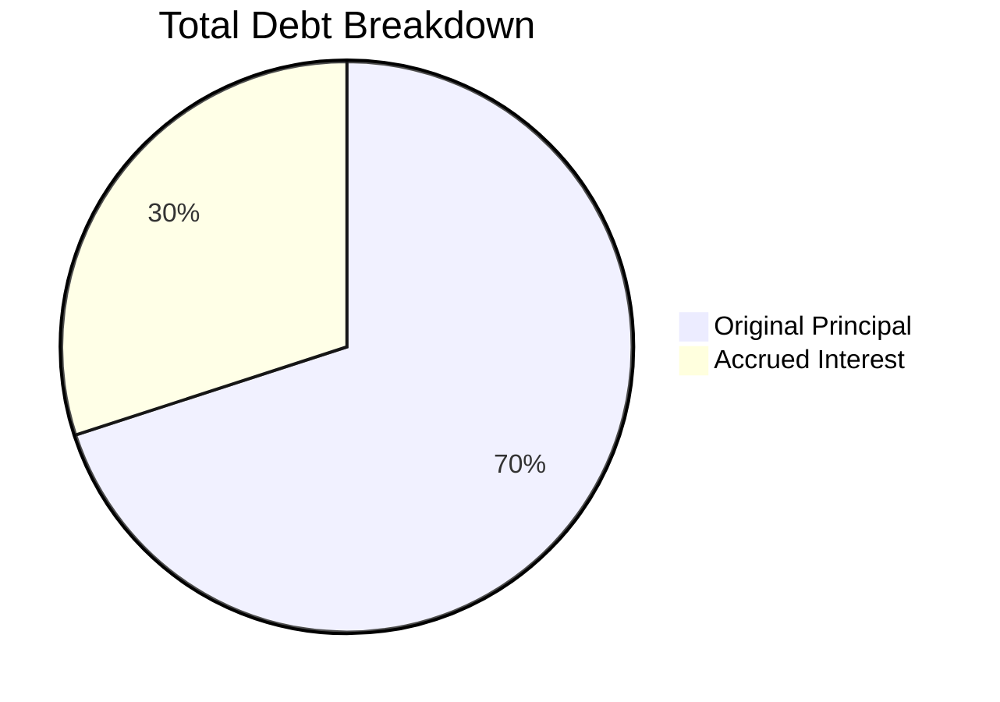

# Repaying Loans

Complete guide to repaying your InfraFi loans with flexible options and strategies.


**No Penalties**: InfraFi has no prepayment penalties. You can repay any amount at any time without fees.


## Repayment Overview

InfraFi offers maximum flexibility for loan repayment, allowing you to manage your debt according to your financial situation and market conditions.

### Repayment Benefits

- ✅ **Anytime**: No payment schedules or due dates
- ✅ **Any Amount**: Partial or full repayment options
- ✅ **No Penalties**: Zero prepayment fees
- ✅ **Immediate Effect**: Interest stops accruing on repaid amount
- ✅ **LTV Improvement**: Better position health with each payment

## Understanding Your Debt

### Debt Components

Your total debt consists of:



#### **Principal vs Interest**
- **Principal**: Original amount borrowed
- **Accrued Interest**: Interest accumulated since borrowing
- **Total Debt**: Principal + All accrued interest

### Interest Calculation

#### **Real-Time Accrual**
Interest compounds every block (~3 seconds on OORT):

```
Block Rate = Annual Rate ÷ Blocks per Year
New Debt = Old Debt × (1 + Block Rate)
```

#### **Example Calculation**
```
Starting Loan: 1,000 WOORT at 7% APY
After 30 days: ~1,017.5 WOORT
After 90 days: ~1,053.4 WOORT  
After 365 days: ~1,070 WOORT
```

## Repayment Strategies

### Full Repayment

#### **When to Repay Fully**
- ✅ **High Interest Rates**: When borrowing costs exceed opportunity cost
- ✅ **Risk Reduction**: Eliminate liquidation risk entirely
- ✅ **Position Closure**: Exit strategy for DePIN lending
- ✅ **Market Uncertainty**: Defensive move during volatility

#### **Full Repayment Benefits**
- 🛡️ **Zero Risk**: Complete elimination of liquidation exposure
- 💰 **No More Interest**: Stop all ongoing borrowing costs
- 🔓 **Full Access**: Recover complete collateral control
- 🔄 **Fresh Start**: Reset for future borrowing opportunities

### Partial Repayment

#### **Strategic Partial Payments**
- 📊 **LTV Management**: Reduce ratio to safer levels
- 💰 **Cost Control**: Lower ongoing interest burden
- ⚖️ **Balance Optimization**: Maintain some leverage while reducing risk
- 🎯 **Targeted Improvement**: Address specific position needs

#### **Partial Repayment Scenarios**

| Current LTV | Repay Amount | New LTV | Result |
|-------------|--------------|---------|---------|
| 75% | 20% of debt | 60% | Much safer |
| 60% | 10% of debt | 54% | Moderate improvement |
| 40% | 25% of debt | 30% | Very conservative |

### Interest-Only Payments

#### **When Appropriate**
- 🔄 **Maintain Position**: Keep leverage while covering costs
- 📈 **Growth Phase**: During active node expansion
- ⏰ **Temporary Relief**: Short-term cash flow management
- 📊 **Market Timing**: Waiting for better conditions


**Interest-Only Strategy**: Useful for maintaining your leveraged position while preventing debt growth from compounding interest.


## Step-by-Step Repayment Process

### Step 1: Check Current Debt

#### **View Debt Information**
1. Navigate to InfraFi dashboard
2. Check "Your Position" section
3. Review debt details:

| Field | Description | Example |
|-------|-------------|---------|
| **Total Debt** | Current amount owed | 1,050 WOORT |
| **Principal** | Original borrowed amount | 1,000 WOORT |
| **Accrued Interest** | Interest earned by protocol | 50 WOORT |
| **Daily Interest** | Current daily cost | ~0.2 WOORT/day |

### Step 2: Prepare WOORT Tokens

#### **Token Acquisition**
Ensure sufficient WOORT balance:
- 💰 **Check Balance**: Verify current WOORT holdings
- 🔄 **Acquire Tokens**: Purchase/earn WOORT if needed
- ⛽ **Gas Reserves**: Keep OORT for transaction fees

#### **Amount Planning**
- **Full Repayment**: Total debt amount + small buffer
- **Partial Repayment**: Desired repayment amount
- **Interest Payment**: Current accrued interest amount

### Step 3: Access Repayment Interface

#### **Navigation**
1. Open InfraFi Protocol app
2. Ensure wallet connected to correct network
3. Click "Repay" in main navigation
4. Verify debt information displayed correctly

#### **Interface Elements**
- 💰 **Current Debt**: Total amount owed
- 📊 **Repayment Input**: Amount entry field
- 🎯 **Impact Preview**: New LTV and position health
- ⚡ **Gas Estimate**: Transaction cost

### Step 4: Enter Repayment Amount

#### **Amount Selection**
Choose your repayment strategy:

**Full Repayment:**
- Click "Max" button or enter total debt amount
- Verify covers all principal and interest
- Add small buffer for interest accrued during transaction

**Partial Repayment:**
- Enter desired amount manually
- Consider impact on LTV ratio
- Ensure meaningful improvement to position

**Interest Only:**
- Enter accrued interest amount
- Keeps principal unchanged
- Prevents further debt growth

### Step 5: Approve Token Spending

#### **WOORT Approval Process**
Before repayment, you must approve token spending:

1. **Approval Transaction**:
   - Click "Approve WOORT" button
   - Confirm approval amount in wallet
   - Submit approval transaction
   - Wait for confirmation

2. **Approval Amount Options**:
   - **Exact Amount**: Approve only repayment amount
   - **Large Allowance**: Approve higher amount for future convenience
   - **Unlimited**: Maximum convenience but higher security risk


**Security Note**: Consider approving only the amount you plan to repay immediately for better security.


### Step 6: Execute Repayment

#### **Repayment Transaction**
1. After WOORT approval confirmed:
   - Click "Repay Loan" button
   - Review transaction details in wallet
   - Verify contract address and amount
   - Submit transaction

#### **Transaction Details**
```javascript
// Repayment transaction:
Contract: 0x74f68Eec49DFAd34E22f3f6F3e38d4d92D8ab676
Function: repay(uint256 amount)
Parameters:
  - amount: 500000000000000000000 // 500 WOORT (18 decimals)
```

### Step 7: Verify Repayment Success

#### **Confirmation Checks**
After transaction confirmation:
- ✅ **WOORT Balance**: Decreased by repayment amount
- ✅ **Debt Reduction**: Total debt lowered appropriately
- ✅ **LTV Improvement**: Better loan-to-value ratio
- ✅ **Interest Savings**: Lower ongoing interest costs

## Advanced Repayment Strategies

### Timing Optimization

#### **Rate-Based Timing**
- **High Rates**: Prioritize repayment when rates spike
- **Low Rates**: Consider maintaining position when rates are favorable
- **Rate Trends**: Monitor utilization trends for timing insights

#### **Market-Based Timing**
- **Volatile Periods**: Reduce leverage during uncertainty
- **Bull Markets**: Maintain leverage during growth phases
- **Bear Markets**: Conservative approach with lower LTV

### Dollar-Cost Averaging

#### **Gradual Repayment Strategy**
Instead of lump-sum repayment:
- 📅 **Regular Payments**: Weekly or monthly repayment schedule
- 📊 **Consistent Amounts**: Same payment amount each period
- 🎯 **LTV Targeting**: Gradual improvement toward target ratio
- 💰 **Budget Friendly**: Spread cost over time

#### **DCA Benefits**
- 🔄 **Smooth Adjustment**: Gradual position improvement
- 💰 **Cash Flow Friendly**: Manageable payment amounts
- 📊 **Discipline**: Consistent debt reduction
- ⚖️ **Balanced Approach**: Maintain some leverage while reducing risk

### Tax Optimization

#### **Interest Deduction Planning**
- 📊 **Business Expense**: Interest may be deductible for business use
- 📅 **Tax Year Timing**: Consider timing for tax optimization
- 📋 **Record Keeping**: Maintain detailed interest payment records
- 💡 **Professional Advice**: Consult tax professional for guidance

## Emergency Repayment Procedures

### High-Risk Situations

#### **LTV Above 75% - Urgent Repayment**
When liquidation risk is elevated:

1. **Immediate Assessment**:
   - Calculate exact repayment needed
   - Check available WOORT balance
   - Determine fastest acquisition method

2. **Emergency Actions**:
   - Use all available WOORT for repayment
   - Convert other tokens if necessary
   - Borrow from other sources if available
   - Contact community for assistance

#### **Market Crash Scenario**
During severe market downturns:
- 🚨 **Immediate Response**: Check position status immediately
- 💸 **Emergency Repayment**: Reduce debt aggressively
- 🔄 **Asset Conversion**: Convert holdings to WOORT for repayment
- 🆘 **Community Help**: Seek assistance and advice

### Emergency Resources

#### **Quick WOORT Acquisition**
- 🔄 **DEX Trading**: Swap other tokens for WOORT
- 🏪 **CEX Purchase**: Buy from centralized exchanges
- 🤝 **Community Lending**: Temporary assistance from others
- 💰 **External Funding**: Use other financial resources

## Common Issues & Troubleshooting

### Transaction Failures

#### **"Insufficient balance"**
**Cause**: Not enough WOORT for repayment  
**Solutions**:
- Check WOORT balance vs debt amount
- Account for interest accrued since last check
- Acquire additional WOORT before repaying

#### **"Allowance exceeded"**  
**Cause**: WOORT approval insufficient  
**Solutions**:
- Increase approval amount
- Approve full repayment amount plus buffer
- Re-submit approval transaction

#### **"Repay amount exceeds debt"**
**Cause**: Trying to repay more than owed  
**Solutions**:
- Check current debt amount
- Use "Max" button for exact amount
- Manually enter amount less than total debt

### Interface Issues

#### **Incorrect Debt Display**
**Solutions**:
- Refresh page to update debt information
- Check for pending transactions
- Wait for blockchain synchronization
- Try different browser or clear cache

#### **Approval Not Working**
**Solutions**:  
- Increase gas limit for approval transaction
- Check wallet connection status
- Verify correct network (OORT testnet)
- Try increasing gas price during congestion

## Best Practices

### Strategic Planning

#### **Repayment Schedule**
- 📅 **Regular Reviews**: Monthly debt assessment
- 🎯 **Target Setting**: Clear LTV goals
- 💰 **Budget Allocation**: Dedicated repayment funds
- 📊 **Performance Tracking**: Monitor progress over time

#### **Opportunity Cost Analysis**
Before repaying, consider:
- 📈 **Alternative Investments**: ROI vs interest cost
- 🔄 **Reinvestment Opportunities**: Node expansion potential
- 💹 **Market Conditions**: Current and expected market state
- ⚖️ **Risk Tolerance**: Personal risk preferences

### Financial Management

#### **Cash Flow Planning**
- 💰 **Income Allocation**: Portion of node earnings for repayment
- 📊 **Budget Integration**: Include interest in expense planning
- 🔄 **Reserve Maintenance**: Keep emergency repayment funds
- 📈 **Growth Balance**: Optimize between growth and risk reduction

## After Repayment

### Position Recovery

#### **Partial Repayment Results**
- 📊 **Improved LTV**: Lower liquidation risk
- 💰 **Reduced Interest**: Lower ongoing costs
- 🔄 **New Capacity**: Additional borrowing ability
- 🛡️ **Enhanced Safety**: Better position health

#### **Full Repayment Results**
- 🎉 **Zero Debt**: Complete loan elimination
- 🔓 **Collateral Freedom**: Full access to withdraw nodes
- 💰 **Interest Savings**: All borrowing costs eliminated
- 🚀 **Fresh Start**: Ready for new strategies

### Future Planning

#### **Post-Repayment Strategy**
- 📊 **Position Assessment**: Evaluate overall performance
- 🎯 **Goal Adjustment**: Refine future objectives
- 💡 **Learning Integration**: Apply lessons learned
- 🔄 **Next Steps**: Plan future DePIN lending activities

---


**Flexible repayment options give you complete control over your debt management.** Use this flexibility to optimize your position and achieve your financial goals.


## Related Resources

**Continue learning:**
- **[Position Management](position-management.md)** - Ongoing position optimization
- **[Withdrawing Nodes](withdrawing.md)** - Recover your collateral
- **[Understanding Liquidations](liquidations.md)** - Avoid forced repayment

**Need Help?**
- 💬 **Discord**: Community support and guidance
- 📚 **FAQ**: [Common questions](../resources/faq.md) answered

---

*Repayment is your path to financial freedom. Choose the strategy that best fits your situation and goals!*
