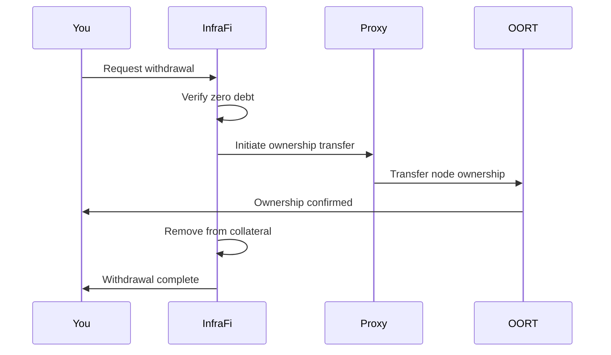

# Withdrawing Nodes

Complete guide to withdrawing your DePIN nodes from InfraFi collateral after loan repayment.


**Requirement**: You must have zero outstanding debt before withdrawing any nodes. All loans must be fully repaid first.


## Withdrawal Overview

Once you've repaid all outstanding debt, you can withdraw your nodes from InfraFi collateral. This process returns full ownership control to your wallet while maintaining all accumulated rewards.

### Withdrawal Process Flow



### What Happens During Withdrawal

- ✅ **Ownership Return**: Node ownership transfers back to your wallet
- ✅ **Collateral Removal**: Node removed from InfraFi collateral tracking
- ✅ **Reward Continuity**: All accumulated rewards remain yours
- ✅ **Operational Freedom**: Complete control over node operations

## Before You Start

### ✅ **Prerequisites**

#### **Debt Status**
- 💰 **Zero Debt**: All loans must be fully repaid
- 📊 **Clean Position**: No outstanding interest or fees
- ✅ **Confirmed Repayment**: Recent repayment transactions confirmed

#### **Node Status**
- 🔧 **Operational**: Nodes should be running normally
- 📈 **Current Earnings**: All rewards up to date
- 🔍 **Performance Check**: Nodes in good standing with network

### 📋 **Pre-Withdrawal Checklist**

#### **Verify Eligibility**
- [ ] **Total Debt = 0 WOORT**: No outstanding balance
- [ ] **All Transactions Confirmed**: Recent repayments processed
- [ ] **Network Status**: OORT network operating normally
- [ ] **Gas Available**: Sufficient OORT for withdrawal transaction

## Step-by-Step Withdrawal Process

### Step 1: Confirm Debt-Free Status

#### **Check Your Position**
1. Open InfraFi Protocol dashboard
2. Navigate to "Your Position" section
3. Verify debt information:

| Metric | Required Value | Status |
|--------|----------------|--------|
| **Total Debt** | 0 WOORT | ✅ Must be zero |
| **Outstanding Interest** | 0 WOORT | ✅ Must be zero |
| **Health Status** | Debt-Free | ✅ Clean position |


**Debt Check**: Even small amounts of outstanding interest will prevent withdrawal. Ensure complete debt elimination.


### Step 2: Select Nodes for Withdrawal

#### **Access Withdrawal Interface**
1. Click "Withdraw" in main navigation
2. Select "Withdraw Nodes" option
3. View your deposited nodes list

#### **Node Selection Options**
- **Individual Selection**: Choose specific nodes to withdraw
- **Batch Selection**: Select multiple nodes for single transaction
- **All Nodes**: Withdraw entire collateral position

#### **Node Information Display**
For each deposited node, you'll see:
- 🆔 **Node ID**: Unique identifier
- 🔧 **Node Type**: Protocol type (OORT = 1)
- 💰 **Current Value**: Real-time assessment
- 📊 **Performance**: Earnings and uptime data
- 🏦 **Proxy Address**: Current custody contract

### Step 3: Review Withdrawal Details

#### **Withdrawal Summary**
Before proceeding, verify:

| Detail | Example | Verify |
|--------|---------|---------|
| **Node IDs** | [123456, 789012] | ✅ Correct nodes selected |
| **Node Count** | 2 nodes | ✅ Expected quantity |
| **Total Value** | 2,500 WOORT | ✅ Reasonable valuation |
| **Gas Estimate** | 0.008 OORT | ✅ Acceptable cost |

#### **Impact Assessment**
- 🔄 **Ownership Transfer**: Nodes return to your direct control
- 💰 **Value Recovery**: Full node value no longer in collateral
- 🎯 **Position Update**: Collateral position reduced/eliminated
- 🔓 **Freedom Restored**: Complete operational control

### Step 4: Execute Withdrawal Transaction

#### **Transaction Confirmation**
1. Click "Withdraw Nodes" button
2. Review transaction in wallet popup
3. Verify contract address and parameters
4. Confirm gas settings appropriate
5. Submit transaction

#### **Transaction Details**
```javascript
// Withdrawal transaction:
Contract: 0x74f68Eec49DFAd34E22f3f6F3e38d4d92D8ab676
Function: withdrawNodes(uint256[], uint256[])
Parameters:
  - nodeIds: [123456, 789012]
  - nodeTypes: [1, 1] // OORT protocol
```

### Step 5: Monitor Transaction Status

#### **Transaction Stages**
1. **Pending**: Transaction submitted to network
2. **Mining**: Being included in block
3. **Confirmed**: Successfully executed
4. **Finalized**: Ownership transfer complete

#### **Confirmation Timeline**
- **OORT Network**: ~3-9 seconds (1-3 blocks)
- **Network Congestion**: May take longer during busy periods
- **Complex Withdrawals**: Multiple nodes may require more gas/time

### Step 6: Verify Successful Withdrawal

#### **Ownership Verification**
After transaction confirmation:

1. **OORT Network Explorer**:
   - Search for your node IDs
   - Confirm your wallet address as owner
   - Verify proxy no longer owns nodes

2. **InfraFi Dashboard**:
   - Check "Your Position" section
   - Confirm nodes removed from collateral list
   - Verify zero collateral value if all withdrawn

3. **Node Operations**:
   - Verify nodes continue operating normally
   - Confirm all earnings flow to your wallet
   - Test node management functions

## Post-Withdrawal Management

### Node Operations

#### **Immediate Actions**
- 🔧 **Operation Check**: Ensure nodes running normally
- 📊 **Performance Monitoring**: Verify earning continuation
- 🔄 **Management Access**: Test all node control functions
- 💰 **Reward Verification**: Confirm earnings flow correctly

#### **Operational Freedom**
You now have complete control to:
- 🔄 **Relocate Nodes**: Move to different networks/locations
- ⚡ **Hardware Upgrades**: Modify node specifications
- 🔧 **Configuration Changes**: Adjust operational parameters
- 💰 **Direct Trading**: Sell or transfer nodes independently

### Position Assessment

#### **Portfolio Review**
After withdrawal:
- 📊 **Performance Analysis**: Evaluate InfraFi lending experience
- 💰 **Cost Assessment**: Calculate total interest paid vs benefits
- 🎯 **Strategy Evaluation**: Review success of leverage strategy
- 📈 **Future Planning**: Consider future DePIN lending opportunities

## Partial Withdrawal Strategies

### Selective Node Withdrawal

#### **Strategic Partial Withdrawal**
Instead of withdrawing all nodes:
- 🎯 **Value Optimization**: Withdraw lower-performing nodes
- 📊 **Portfolio Rebalancing**: Maintain best nodes as collateral
- 🔄 **Flexibility Maintenance**: Keep some borrowing capacity
- 💰 **Cash Generation**: Sell withdrawn nodes for liquidity

#### **Partial Withdrawal Benefits**
- ⚖️ **Risk Management**: Reduce collateral exposure while maintaining position
- 🔄 **Operational Flexibility**: Direct control over selected nodes
- 📈 **Growth Options**: Maintain borrowing capacity for opportunities
- 🎯 **Performance Focus**: Keep highest-performing nodes in protocol

## Troubleshooting

### Common Issues

#### **"Outstanding loan must be repaid"**
**Cause**: Debt remains on your position  
**Solutions**:
- Check for any remaining debt, including accrued interest
- Complete full loan repayment before attempting withdrawal
- Wait for repayment transaction to confirm
- Refresh dashboard to update debt status

#### **"Node not deposited"**
**Cause**: Trying to withdraw node that isn't collateral  
**Solutions**:
- Verify node ID is correct and currently deposited
- Check node appears in your collateral list
- Confirm you're using the correct wallet address
- Contact support if node status appears incorrect

#### **"Transaction failed"**
**Cause**: Various network or contract issues  
**Solutions**:
- Increase gas limit for withdrawal transaction
- Check OORT network status and congestion
- Verify sufficient OORT balance for gas fees
- Try again during less congested periods

### Network Issues

#### **Withdrawal Not Showing**
**Cause**: Blockchain synchronization delay  
**Solutions**:
- Wait 5-10 minutes for blockchain updates
- Refresh browser and reconnect wallet
- Check transaction status on OORT explorer
- Verify transaction actually succeeded

#### **Node Still Shows Proxy Owner**
**Cause**: OORT network update delay  
**Solutions**:
- Allow up to 15 minutes for network update
- Check transaction receipt for successful events
- Verify correct node ID being checked
- Contact support if ownership doesn't update

## Best Practices

### Timing Strategy

#### **Optimal Withdrawal Timing**
- 📊 **Market Conditions**: Consider node value trends
- ⚡ **Network Congestion**: Withdraw during off-peak hours
- 💰 **Cost Optimization**: Minimize gas fees through timing
- 🔄 **Operational Needs**: Align with node management requirements

#### **Strategic Considerations**
- 📈 **Growth Phase**: Keep high-performing nodes for future borrowing
- 🛡️ **Risk Reduction**: Withdraw during uncertain market conditions
- 💰 **Liquidity Needs**: Withdraw nodes for direct monetization
- 🎯 **Portfolio Optimization**: Selective withdrawal for rebalancing

### Security Practices

#### **Pre-Withdrawal Security**
- ✅ **Verify Contracts**: Confirm official InfraFi addresses
- ✅ **Check Balances**: Ensure sufficient gas for withdrawal
- ✅ **Backup Access**: Secure wallet backup before major transactions
- ✅ **Network Verification**: Confirm connected to correct network

#### **Post-Withdrawal Security**
- 🔧 **Node Security**: Verify node infrastructure remains secure
- 💰 **Reward Monitoring**: Confirm earnings flow to correct address
- 🔍 **Performance Check**: Verify optimal node configuration
- 📊 **Access Control**: Review node management permissions

## Advanced Withdrawal Strategies

### Portfolio Optimization

#### **Performance-Based Selection**
- 📊 **Analytics Review**: Withdraw underperforming nodes
- 🎯 **Quality Focus**: Keep highest-earning nodes
- 🔄 **Diversification**: Maintain geographic/hardware diversity
- 📈 **Growth Planning**: Align with expansion strategies

#### **Market-Driven Decisions**
- 💹 **Market Timing**: Withdraw before expected downturns
- 📈 **Growth Positioning**: Keep nodes during expansion phases
- ⚖️ **Risk Management**: Reduce exposure during uncertainty
- 🔄 **Opportunity Capture**: Free nodes for new opportunities

### Re-Entry Planning

#### **Future Borrowing Preparation**
- 📊 **Performance Tracking**: Monitor withdrawn node performance
- 💰 **Value Optimization**: Improve node earning potential
- 🎯 **Strategic Positioning**: Prepare for future collateralization
- 📈 **Capacity Building**: Expand node portfolio for future lending

## What's Next?

After successful node withdrawal:

### Immediate Actions
- 🔧 **Node Management**: Ensure optimal operation
- 📊 **Performance Monitoring**: Track earnings and efficiency
- 💰 **Revenue Optimization**: Maximize node profitability
- 🔍 **Health Maintenance**: Regular node health checks

### Future Opportunities
- 🔄 **Re-Engagement**: Consider future InfraFi lending
- 📈 **Portfolio Growth**: Expand node operations
- 🌐 **Multi-Protocol**: Explore other DePIN networks
- 💡 **Strategy Evolution**: Develop advanced DePIN finance strategies

---


**Congratulations!** You've successfully recovered full control of your nodes while having benefited from InfraFi's lending capabilities. Your infrastructure continues earning while you maintain complete operational freedom.


## Need Help?

**Community Support:**
- 💬 **Discord**: Real-time withdrawal assistance
- 📚 **Documentation**: Check [FAQ](../resources/faq.md) for common issues
- 🐛 **GitHub**: Report technical problems

**Emergency Issues:**
- 🆘 **Discord #emergency**: Critical withdrawal problems
- 📧 **Direct Contact**: Complex technical issues

---

*Withdrawal marks the successful completion of your DePIN lending journey. You've unlocked liquidity from your infrastructure while maintaining its productivity!*
