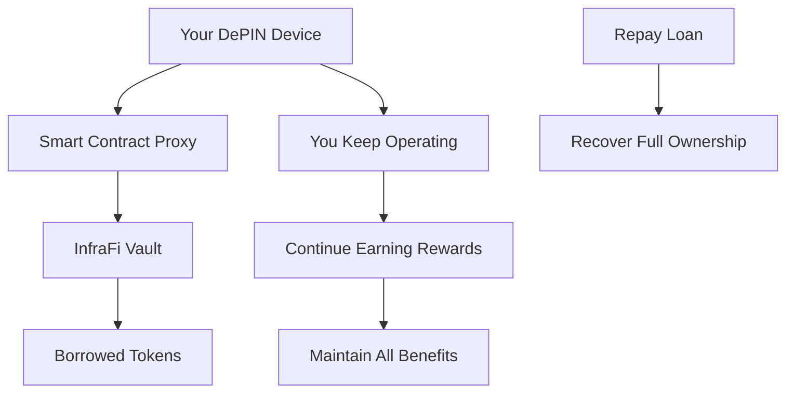

# What is InfraFi Protocol?

InfraFi Protocol is the **first decentralized lending protocol designed specifically for Decentralized Physical Infrastructure Networks (DePIN)**. We enable owners of physical infrastructure devices to unlock liquidity from their hardware investments while maintaining full operational control and earning rights.

## The Problem We Solve

The DePIN ecosystem has grown to over **$25 billion in total value**, with hundreds of thousands of individuals operating physical infrastructure devices like:

- **OORT compute nodes** for edge computing and AI
- **Helium hotspots** for wireless connectivity  
- **Filecoin storage miners** for distributed storage
- **Render Network GPUs** for compute rendering

### The Liquidity Challenge

Despite this massive growth, infrastructure operators face a fundamental problem: **their valuable assets are illiquid**.

**Traditional Solutions Don't Work**:
- 🚫 **Selling devices** terminates future earning potential
- 🚫 **Traditional loans** don't understand DePIN asset value
- 🚫 **Existing DeFi** only handles digital collateral

## Our Solution

InfraFi bridges this gap with a novel lending protocol that treats physical infrastructure as **productive collateral**.

### Core Innovation: Proxy-Based Custody

Instead of taking physical custody, InfraFi uses smart contract proxies that manage on-chain ownership rights while you maintain full operational control:

### How It Works

1. **Deposit Your Device**: Transfer ownership to InfraFi's secure proxy system
2. **Device Keeps Operating**: No interruption to your infrastructure operations
3. **Borrow Against Value**: Access up to 80% of your device's assessed value
4. **Keep Earning**: All rewards and benefits remain yours during the loan
5. **Repay When Ready**: Full ownership returns upon loan repayment

## Key Features

### 🔓 **Unlock Liquidity**
- Borrow against device value without selling
- Access capital for expansion or other investments
- Flexible loan terms and repayment options

### 💰 **Keep Earning**
- Devices continue normal operations
- All network rewards remain yours
- No interruption to cash flow

### 🏦 **Competitive Rates**
- Interest rates starting at 3% APY
- Dynamic pricing based on utilization
- No hidden fees or penalties

### 🛡️ **Security First**
- Smart contract audits and security reviews
- Emergency pause and recovery mechanisms
- Multi-signature administrative controls

### 🌐 **Multi-Protocol Support**
- Currently: OORT Network (live on testnet)
- Coming: Helium, Filecoin, Render Network
- Modular architecture for easy expansion

## Market Opportunity

### DePIN Ecosystem Growth
- **$25+ Billion**: Current total value locked
- **500,000+**: Active infrastructure devices
- **45-60% CAGR**: Projected growth through 2027

### Addressable Market
- **$7.5 Billion**: Potential borrowing capacity at 50% LTV
- **Zero Competition**: No existing DePIN lending solutions
- **Network Effects**: Value increases with each new protocol

## Why Now?

### Market Timing
1. **DePIN Maturity**: Networks have proven product-market fit
2. **Capital Constraints**: Operators seeking growth financing
3. **DeFi Evolution**: Market ready for physical asset integration
4. **Technical Readiness**: Infrastructure for secure implementation exists

### Competitive Advantages
- **First-Mover**: No existing DePIN lending protocols
- **Technical Moat**: Complex custody and valuation requirements
- **Network Effects**: Stronger with each additional protocol
- **Community-Driven**: Open source with decentralized governance

## Use Cases

### For Individual Operators
- **Expand Infrastructure**: Borrow to buy additional devices
- **Smooth Cash Flow**: Access liquidity during reward cycles
- **Diversify Investments**: Free up capital for other opportunities
- **Emergency Funding**: Quick access to device value

### For Professional Operators
- **Scale Operations**: Leverage existing assets for growth
- **Working Capital**: Fund operational expenses
- **Risk Management**: Hedge against device value fluctuations
- **Portfolio Optimization**: Rebalance across different protocols

### For The Ecosystem
- **Increased Adoption**: Lower barriers to entry for new operators
- **Network Growth**: Faster expansion of physical infrastructure
- **Capital Efficiency**: Better utilization of deployed assets
- **Financial Innovation**: New primitives for physical asset finance

## What's Next?

Ready to dive deeper? Explore these sections:

- **[Executive Summary](executive-summary.md)** - Key highlights and business overview
- **[Key Features](key-features.md)** - Detailed feature breakdown  
- **[Market Opportunity](market-opportunity.md)** - Comprehensive market analysis
- **[Get Started](../getting-started/quickstart.md)** - Try InfraFi on testnet

Or jump straight to:
- **[Protocol Deep Dive](../protocol/)** - Technical architecture
- **[User Guides](../guides/)** - Step-by-step instructions
- **[Developer Docs](../developers/)** - Integration resources

---

**InfraFi Protocol: Bridging physical infrastructure and decentralized finance** 🌉
