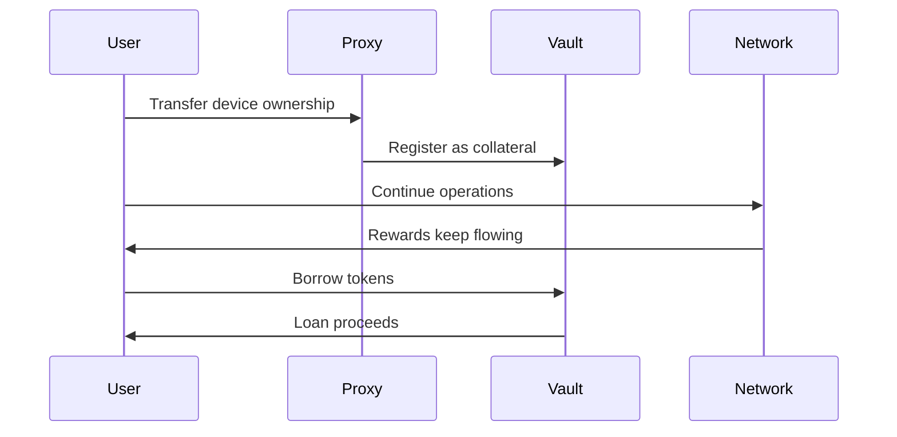
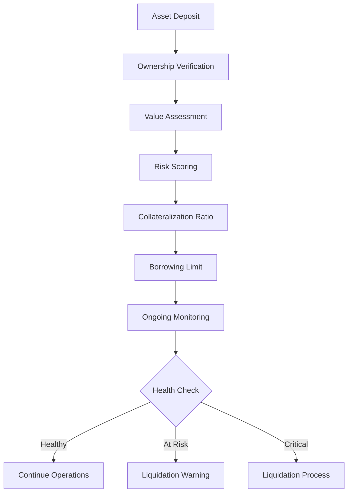
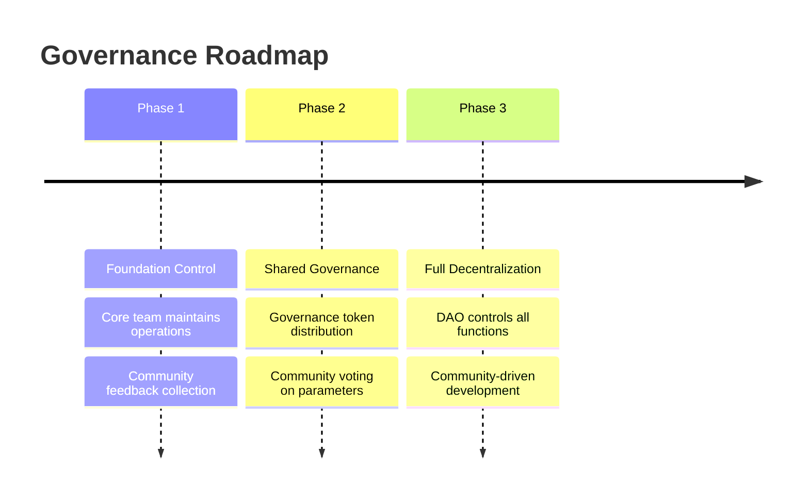

# Key Features

InfraFi Protocol introduces several breakthrough innovations that make it the first viable lending solution for physical infrastructure assets.

## 🔄 Proxy-Based Custody System

### The Innovation
Unlike traditional collateral that requires physical custody, InfraFi uses **smart contract proxies** that manage ownership rights while preserving operational control.

### How It Works


### Benefits
- ✅ **No Operational Disruption**: Devices continue working normally
- ✅ **Maintain Earning Rights**: All rewards remain yours
- ✅ **Security**: Automated ownership management
- ✅ **Flexibility**: Easy recovery upon repayment

---

## 💎 Dynamic Asset Valuation

### Real-Time Pricing
InfraFi assesses device value using multiple data sources:

#### **Hardware Value**
- Device specifications and market pricing
- Age, condition, and performance metrics
- Market demand and replacement costs

#### **Earning Potential**  
- Historical reward generation
- Network performance and uptime
- Future earning projections

#### **Network Health**
- Protocol token economics
- Network participation rates
- Validator performance metrics

### Valuation Formula
```
Total Asset Value = Hardware Value + Staked Assets + Earned Rewards
Available Collateral = Total Asset Value × Collateralization Ratio
```

### Live Updates
- Real-time value tracking
- Performance-based adjustments  
- Market condition responses
- Automated rebalancing

---

## 🌐 Multi-Protocol Architecture

### Modular Design
InfraFi's adapter system supports diverse DePIN networks through unified interfaces:

```
Core Vault System
├── OORT Adapter (Live)
├── Helium Adapter (Q2 2025)
├── Filecoin Adapter (Q3 2025)  
├── Render Adapter (Q4 2025)
└── Custom Adapters (Community)
```

### Protocol Integration Features
- **Unified Interface**: Same user experience across all networks
- **Specialized Logic**: Custom handling for each protocol's unique features
- **Cross-Protocol Risk**: Portfolio diversification across networks
- **Community Expansion**: Open framework for new integrations

### Current & Planned Support

| Protocol | Asset Type | Status | Launch Target |
|----------|------------|--------|---------------|
| **OORT** | Compute Nodes | ✅ Live | Testnet Active |
| **Helium** | Wireless Hotspots | 🔄 Development | Q2 2025 |
| **Filecoin** | Storage Miners | 📋 Planned | Q3 2025 |
| **Render** | GPU Compute | 📋 Planned | Q4 2025 |

---

## 💰 Competitive Interest Rates

### Jump Rate Model
InfraFi uses an optimized interest rate model designed for infrastructure assets:

```
Interest Rate = Base Rate + (Utilization × Multiplier) + Jump Rate
```

### Rate Parameters
- **Base Rate**: 3% APY minimum
- **Multiplier**: 8% per 100% utilization (below kink)
- **Jump Multiplier**: 50% per 100% utilization (above kink)  
- **Kink Point**: 80% utilization

### Rate Examples

| Pool Utilization | Interest Rate | Annual Cost on $1,000 |
|------------------|---------------|------------------------|
| 20% | 4.6% APY | $46 |
| 50% | 7% APY | $70 |
| 80% | 9.4% APY | $94 |
| 90% | 14.4% APY | $144 |

### Borrower Benefits
- 🏆 **Below-Market Rates**: Competitive with traditional finance
- 📈 **Utilization-Based**: Pay less when supply is abundant
- 💵 **Partial Payments**: Flexible repayment options
- 🚫 **No Prepayment Penalty**: Repay anytime without fees

---

## 🛡️ Advanced Security Framework

### Smart Contract Security
- **OpenZeppelin Standards**: Battle-tested security libraries
- **Reentrancy Protection**: Guards on all external functions
- **Access Controls**: Multi-role permission system
- **Emergency Pause**: Circuit breakers for critical issues

### Audit & Verification
- **Internal Review**: Comprehensive security analysis
- **External Audit**: Professional security firm review (planned)
- **Formal Verification**: Mathematical proof of critical functions
- **Bug Bounty**: Ongoing community security program

### Operational Security
- **Multi-Signature Controls**: Administrative function protection  
- **Time-Locked Upgrades**: Community review period for changes
- **Monitoring Systems**: 24/7 protocol health monitoring
- **Incident Response**: Rapid response procedures

### Risk Management


---

## 📊 Transparent Liquidation System

### Liquidation Mechanics
- **Threshold**: 80% LTV triggers liquidation eligibility
- **Grace Period**: 24-hour warning before liquidation
- **Partial Liquidation**: Only liquidate amount needed for health
- **Liquidator Bonus**: 5% incentive for liquidation execution

### Protection Features
- **Rate Limiting**: Maximum liquidations per block
- **Cooldown Period**: Prevents cascading liquidations
- **Authorized Liquidators**: Qualified participants only
- **Fair Pricing**: Market-based asset valuation

### User Protections
- 🔔 **Early Warnings**: Notifications before liquidation risk
- ⏰ **Grace Period**: Time to add collateral or repay debt  
- 📊 **Transparent Process**: Clear liquidation criteria
- 💰 **Minimal Impact**: Partial liquidation when possible

---

## 🔧 Developer-Friendly Integration

### API & SDK
- **RESTful APIs**: Standard HTTP interfaces
- **GraphQL Support**: Flexible data querying
- **WebSocket Streams**: Real-time updates
- **SDKs Available**: JavaScript, Python, Go

### Smart Contract Interfaces
```solidity
interface IInfraFiVault {
    function depositNodes(uint256[] nodeIds, uint256[] nodeTypes) external;
    function borrow(uint256 amount) external;
    function repay(uint256 amount) external;
    function withdrawNodes(uint256[] nodeIds, uint256[] nodeTypes) external;
}
```

### Integration Support
- **Documentation**: Comprehensive guides and examples
- **Testing Environment**: Full-featured testnet
- **Developer Tools**: CLI tools and debugging utilities
- **Community Support**: Developer Discord and forums

---

## 🏛️ Decentralized Governance

### Governance Evolution


### Governance Scope
- **Protocol Parameters**: Interest rates, LTV ratios, liquidation thresholds
- **New Integrations**: Approval of new DePIN protocol support  
- **Upgrade Decisions**: Smart contract improvements and features
- **Treasury Management**: Protocol revenue allocation
- **Emergency Actions**: Response to critical situations

### Participation Benefits
- 🗳️ **Voting Rights**: Influence protocol direction
- 💰 **Revenue Sharing**: Share in protocol success
- 🎯 **Exclusive Access**: Early access to new features
- 🏆 **Recognition**: Governance contributor acknowledgments

---

## 🚀 Future Innovations

### Phase 2 Features (2025)
- **Position NFTs**: Transferable lending positions
- **Yield Optimization**: Automated strategy execution  
- **Cross-Chain Support**: Multi-blockchain deployment
- **Institutional Features**: Advanced risk management tools

### Phase 3 Vision (2026+)
- **AI-Powered Valuation**: Machine learning asset assessment
- **Insurance Integration**: Protection against device failure
- **Synthetic Assets**: Tokenized infrastructure exposure
- **Global Infrastructure Finance**: Standard for physical asset DeFi

---

Ready to experience these features yourself? **[Get started with our testnet](../getting-started/quickstart.md)** or explore the **[technical architecture](../protocol/architecture.md)** for deeper insights.
