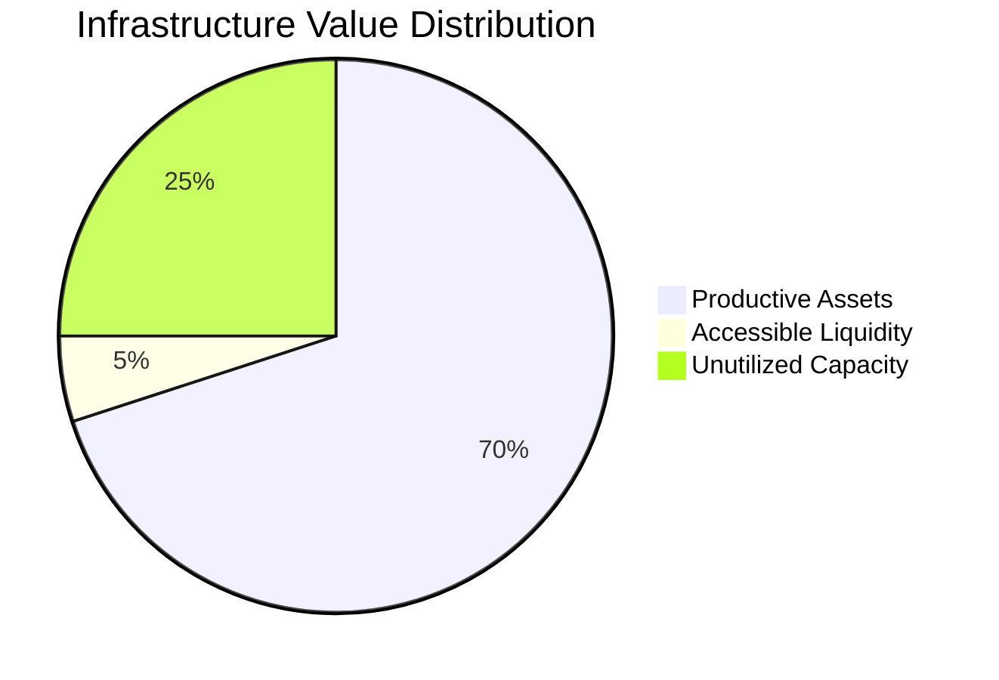

# Market Opportunity

InfraFi Protocol addresses a massive and growing market opportunity in the intersection of DePIN and DeFi sectors.

## The DePIN Ecosystem

### Current Market Size
- **$25+ Billion**: Total value locked across DePIN protocols (2024)
- **500,000+**: Active infrastructure devices globally
- **180+ Countries**: Geographic distribution of DePIN operations
- **$5+ Billion**: Annual hardware investment in new deployments

### Major DePIN Networks
| Protocol | Sector | Market Cap | Active Devices | Infrastructure Value |
|----------|--------|------------|----------------|---------------------|
| **Helium** | Wireless | $1.2B | 300,000+ | $8B+ |
| **Filecoin** | Storage | $2.1B | 4,000+ | $5B+ |
| **OORT** | Compute | $150M | 10,000+ | $500M+ |
| **Render** | GPU Compute | $800M | 5,000+ | $2B+ |

## The Liquidity Problem

### Capital Trapped in Infrastructure


**Key Statistics:**
- **$15+ Billion**: Illiquid infrastructure value
- **0%**: Current liquidity utilization rate
- **6-18 months**: Typical device payback period
- **2-5 years**: Average device operational lifespan

### Market Inefficiencies
- 🔒 **Liquidity Lock-up**: Valuable assets producing returns but inaccessible
- 📈 **Growth Constraints**: Operators can't leverage existing assets for expansion
- 💰 **Opportunity Cost**: Capital tied up in single-purpose infrastructure
- 🏗️ **Barrier to Entry**: High upfront costs limit network participation

## InfraFi's Addressable Market

### Total Addressable Market (TAM)
**$7.5 Billion** potential borrowing capacity at 50% conservative LTV

**Calculation:**
```
Infrastructure Value: $15B (deployed DePIN assets)
× Conservative LTV: 50%
= Addressable Market: $7.5B
```

### Serviceable Available Market (SAM)
**$2.5 Billion** near-term addressable with planned protocol support

**Target Networks (Phase 1-2):**
- OORT Network: $250M infrastructure value
- Helium Network: $4B infrastructure value (subset addressable)
- Filecoin Network: $2.5B infrastructure value (subset addressable)
- Render Network: $1B infrastructure value (subset addressable)

### Serviceable Obtainable Market (SOM)
**$100-500 Million** realistic 3-year capture based on DeFi adoption rates

**Market Penetration Assumptions:**
- Year 1: 2-5% of addressable market
- Year 2: 5-10% of addressable market  
- Year 3: 10-20% of addressable market

## Growth Drivers

### 1. **DePIN Sector Expansion**
- **45-60% CAGR**: Projected sector growth through 2027
- **2+ Million Devices**: Expected by 2027
- **100+ Protocols**: New networks launching continuously
- **$50+ Billion**: Cumulative infrastructure investment projected

### 2. **DeFi Integration Trend**
- **Real-World Assets**: Growing focus on physical asset tokenization
- **Yield Optimization**: Demand for productive asset utilization
- **Capital Efficiency**: Institutional demand for leveraged strategies
- **Cross-Chain Growth**: Multi-blockchain infrastructure deployment

### 3. **Regulatory Clarity**
- **DePIN Recognition**: Governments embracing decentralized infrastructure
- **DeFi Maturity**: Clearer regulatory frameworks emerging
- **Physical Asset Benefits**: Tangible backing reduces regulatory concerns
- **Global Adoption**: Supportive policies in key jurisdictions

## Competitive Landscape

### Direct Competition
**None** - No existing protocols serve DePIN asset collateralization

### Indirect Competition
- **Traditional DeFi Lending**: Compound, Aave, MakerDAO (digital assets only)
- **Physical Asset Tokenization**: Real estate, commodities (different custody models)
- **Network-Specific Solutions**: Individual protocol treasury programs

### Competitive Advantages
- ✅ **First-Mover**: No existing DePIN lending solutions
- ✅ **Technical Moat**: Complex custody and valuation requirements
- ✅ **Network Effects**: Value increases with each protocol integration
- ✅ **Operational Continuity**: Unique preservation of asset productivity

## Revenue Opportunity

### Revenue Streams
1. **Interest Income**: 3-15% APY on $100M-500M TVL
2. **Liquidation Fees**: 5-10% on liquidation events
3. **Protocol Fees**: Future revenue on lending volume
4. **Premium Services**: Institutional and advanced features

### Projected Revenue
| Year | TVL | Interest Revenue | Total Revenue |
|------|-----|------------------|---------------|
| Year 1 | $10M | $500K | $750K |
| Year 2 | $50M | $3M | $4.5M |
| Year 3 | $200M | $15M | $22M |

## Market Timing

### Why Now?

#### **DePIN Market Maturity**
- Proven business models and sustainable tokenomics
- Established user base with capital deployment experience
- Growing institutional interest in physical infrastructure

#### **DeFi Infrastructure Readiness**  
- Mature smart contract platforms and security standards
- Established lending protocol patterns and user interfaces
- Cross-chain interoperability solutions available

#### **Capital Market Conditions**
- Growing demand for real-world asset exposure
- Interest in yield-generating strategies
- Institutional DeFi adoption accelerating

#### **Technology Convergence**
- IoT and edge computing infrastructure expansion
- Blockchain scalability improvements
- Oracle and data feed infrastructure maturity

## Go-to-Market Strategy

### Phase 1: OORT Network (2024-2025)
**Target Market**: 10,000+ OORT node operators
- **Opportunity**: $250M infrastructure value
- **Strategy**: Direct community engagement and partnerships
- **Success Metrics**: $10M TVL, 1,000+ users

### Phase 2: Multi-Protocol Expansion (2025-2026)
**Target Market**: Helium, Filecoin, Render communities
- **Opportunity**: $2B+ infrastructure value
- **Strategy**: Protocol partnerships and adapter development
- **Success Metrics**: $100M TVL, 10,000+ users

### Phase 3: Ecosystem Integration (2026+)
**Target Market**: Entire DePIN ecosystem + institutional users
- **Opportunity**: $5B+ infrastructure value
- **Strategy**: DeFi composability and institutional services
- **Success Metrics**: $500M+ TVL, market leadership

## Risk Assessment

### Market Risks
- **DePIN Adoption Slower**: Growth may be more gradual than projected
- **Competition Emergence**: Other protocols may enter the space
- **Regulatory Changes**: Evolving regulations could impact operations

### Mitigation Strategies
- **Conservative Projections**: Base case assumes slower growth
- **First-Mover Advantage**: Establish network effects and partnerships
- **Compliance Focus**: Proactive regulatory engagement and adaptation

---


**Bottom Line**: InfraFi addresses a $7.5B+ market opportunity with no direct competition, strong growth drivers, and clear first-mover advantages in the rapidly expanding DePIN sector.


## Next Steps

Ready to dive deeper? Explore:

- **[Key Features](key-features.md)** - How InfraFi captures this opportunity
- **[Executive Summary](executive-summary.md)** - Complete business overview
- **[Protocol Deep Dive](../protocol/)** - Technical implementation
- **[Get Started](../getting-started/)** - Try InfraFi today
