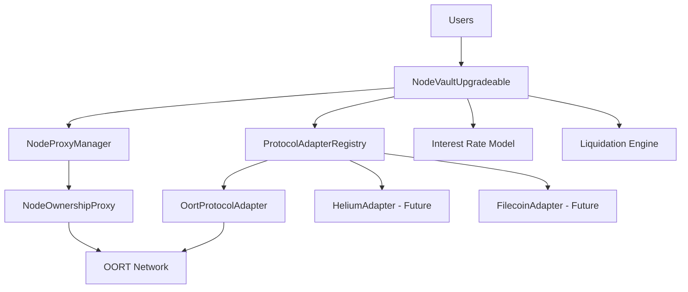
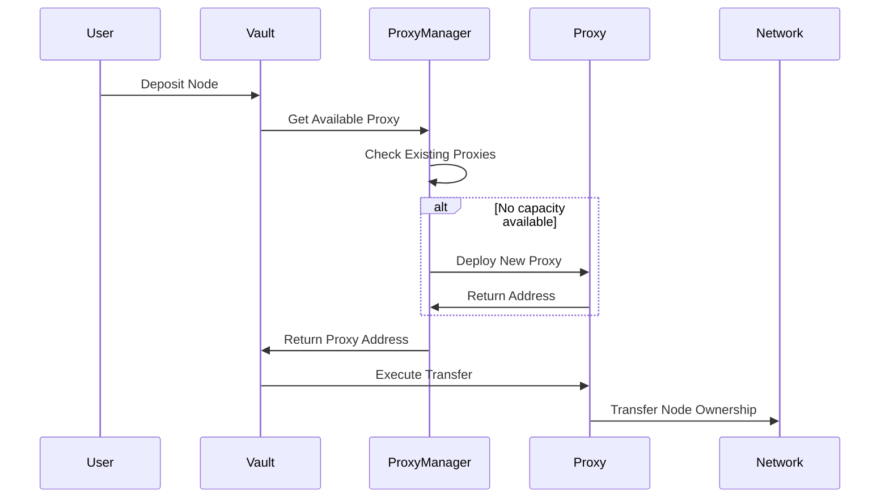

# Smart Contract Architecture

InfraFi Protocol's technical architecture designed for secure, scalable DePIN asset lending.

## System Overview

InfraFi consists of modular smart contracts that work together to enable DePIN asset collateralization:



## Core Contracts

### 1. NodeVaultUpgradeable
**Main lending contract and system coordinator**

#### **Responsibilities**
- User deposit and withdrawal management
- Loan origination and repayment processing
- Interest rate calculation and accrual
- Liquidation coordination and execution
- Risk management and health monitoring

#### **Key Functions**
```solidity
// Primary user operations
function depositNodes(uint256[] nodeIds, uint256[] nodeTypes) external;
function borrow(uint256 amount) external;
function repay(uint256 amount) external;  
function withdrawNodes(uint256[] nodeIds, uint256[] nodeTypes) external;

// Risk management
function liquidate(address borrower, uint256 repayAmount, 
                  uint256[] nodeIds, uint256[] nodeTypes) external;
function getUserHealth(address user) external view returns (uint256 ltv);
```

#### **Architecture Features**
- ✅ **Upgradeable**: UUPS pattern for protocol evolution
- ✅ **Pausable**: Emergency stop functionality
- ✅ **Access Control**: Multi-role permission system
- ✅ **Reentrancy Protection**: OpenZeppelin guards

### 2. NodeProxyManager
**Manages proxy contracts for protocol ownership limits**

#### **Purpose**
DePIN protocols often limit nodes per address (OORT: 64 nodes max). The ProxyManager automatically deploys and manages proxy contracts to handle these constraints.

#### **Key Features**
```solidity
// Proxy lifecycle management
function getOrCreateProxy(uint256 nodeType) external returns (address);
function setProtocolMaxNodes(uint256 nodeType, uint256 maxNodes) external;

// Node assignment tracking  
function recordNodeAssignment(uint256 nodeId, uint256 nodeType, 
                             address proxy) external;
function getProxyForNode(uint256 nodeId, uint256 nodeType) 
                        external view returns (address);
```

#### **Smart Proxy Deployment**


### 3. ProtocolAdapterRegistry
**Central coordination for multi-protocol support**

#### **Adapter Pattern**
The registry implements a plugin architecture allowing InfraFi to support diverse DePIN networks through specialized adapters.

#### **Core Interface**
```solidity
interface IProtocolAdapter {
    // Protocol information
    function getProtocolInfo() external view returns (ProtocolInfo memory);
    
    // Asset valuation
    function getNodeValue(uint256 nodeId) external view returns (NodeValue memory);
    
    // Deposit operations
    function getDepositSteps(uint256 nodeId, address currentOwner, 
                           address targetOwner) external view 
                           returns (DepositStep[] memory);
    
    // Withdrawal operations  
    function getWithdrawalSteps(uint256 nodeId, address currentOwner,
                              address targetOwner) external view
                              returns (WithdrawalStep[] memory);
}
```

#### **Registry Management**
```solidity
// Adapter registration and management
function registerAdapter(uint256 protocolType, address adapter) external;
function getAdapter(uint256 protocolType) external view returns (IProtocolAdapter);
function isProtocolSupported(uint256 protocolType) external view returns (bool);
```

### 4. NodeOwnershipProxy
**Individual proxy contracts for node custody**

#### **Proxy Functions**
Each proxy is a minimal contract that:
- Holds ownership of up to N nodes (protocol-specific limit)
- Executes transfers on behalf of the vault
- Maintains isolation between different users' assets

#### **Security Features**
```solidity
contract NodeOwnershipProxy {
    address public immutable vault;
    uint256 public immutable maxNodes;
    uint256 public immutable protocolType;
    
    modifier onlyVault() {
        require(msg.sender == vault, "Only vault can execute");
        _;
    }
    
    function executeTransfer(address target, bytes calldata data) 
        external onlyVault {
        // Execute transfer with vault authorization only
    }
}
```

## Protocol Adapters

### Current: OortProtocolAdapter

#### **OORT Integration**
```solidity
contract OortProtocolAdapter is IProtocolAdapter {
    address public immutable oortNodeContract;
    NodeProxyManager public immutable proxyManager;
    
    function getNodeValue(uint256 nodeId) external view override 
        returns (NodeValue memory) {
        // Query OORT network for real-time node data
        address nodeAddress = nodeIdToAddress(nodeId);
        NodeData memory data = IOortNode(oortNodeContract)
                              .nodeDataInfo(nodeAddress);
        
        return NodeValue({
            totalValue: data.balance,
            liquidValue: data.balance - data.lockedRewards,
            collateralValue: data.balance,
            lastUpdate: block.timestamp
        });
    }
}
```

#### **Valuation Logic**
OORT nodes are valued based on:
- **Total Balance**: Staked tokens + earned rewards
- **Liquid Portion**: Immediately accessible value
- **Performance Metrics**: Uptime and earning history

### Future: Multi-Protocol Support

#### **Planned Adapters**
| Protocol | Asset Type | Valuation Method | Timeline |
|----------|------------|------------------|----------|
| **Helium** | Wireless Hotspots | HNT staking + earnings | Q2 2025 |
| **Filecoin** | Storage Miners | FIL collateral + rewards | Q3 2025 |
| **Render** | GPU Compute | RNDR staking + utilization | Q4 2025 |

## Security Architecture

### Access Control System

#### **Role-Based Permissions**
```solidity
// OpenZeppelin AccessControl integration
bytes32 public constant LIQUIDATOR_ROLE = keccak256("LIQUIDATOR_ROLE");
bytes32 public constant EMERGENCY_ROLE = keccak256("EMERGENCY_ROLE");
bytes32 public constant UPGRADE_ROLE = keccak256("UPGRADE_ROLE");

modifier onlyLiquidator() {
    require(hasRole(LIQUIDATOR_ROLE, msg.sender), "Not liquidator");
    _;
}
```

#### **Multi-Signature Controls**
- **Ownership**: Critical functions require multi-sig approval
- **Upgrades**: Time-locked with community governance
- **Parameter Changes**: Gradual adjustment with safeguards

### Emergency Mechanisms

#### **Circuit Breakers**
```solidity
// Emergency pause system
bool public emergencyStop;

modifier notInEmergency() {
    require(emergencyStop == false, "Emergency stop active");
    _;
}

function emergencyPause() external onlyRole(EMERGENCY_ROLE) {
    emergencyStop = true;
    emit EmergencyPause(msg.sender, block.timestamp);
}
```

#### **Fund Protection**
- **Isolated Failures**: Individual proxy failures don't affect others
- **Graceful Degradation**: System continues operating with reduced functionality
- **Recovery Procedures**: Clear processes for emergency situations

## Interest Rate Model

### Jump Rate Implementation

#### **Rate Calculation**
```solidity
function calculateBorrowRate(uint256 cash, uint256 borrows) 
    internal view returns (uint256) {
    
    if (borrows == 0) return baseRatePerYear;
    
    uint256 utilization = (borrows * SCALE) / (cash + borrows);
    
    if (utilization <= kink) {
        // Linear rate below kink
        return baseRatePerYear + (utilization * multiplierPerYear / SCALE);
    } else {
        // Jump rate above kink
        uint256 normalRate = baseRatePerYear + (kink * multiplierPerYear / SCALE);
        uint256 excessUtil = utilization - kink;
        return normalRate + (excessUtil * jumpMultiplierPerYear / SCALE);
    }
}
```

#### **Interest Accrual**
```solidity
// Compound-style interest accrual with accurate debt tracking
function _updateRateIndices() internal {
    uint256 timeElapsed = block.timestamp - lastUpdateTimestamp;
    
    if (timeElapsed > 0) {
        uint256 previousBorrowIndex = borrowIndex;
        
        // Update borrow index: borrowIndex *= (1 + rate * time / year)
        uint256 currentBorrowRate = _getBorrowAPYFromPrincipalUtilization();
        borrowIndex = borrowIndex + (borrowIndex * timeElapsed * currentBorrowRate) 
                     / (365 days * BASIS_POINTS);
        
        // Update totalDebt by the index growth ratio
        if (totalRepaid < totalLent) {
            uint256 principalDebt = totalLent - totalRepaid;
            if (totalDebt == 0) {
                totalDebt = principalDebt;
            }
            totalDebt = (totalDebt * borrowIndex) / previousBorrowIndex;
        } else {
            totalDebt = 0;
        }
        
        // Update supply index similarly
        uint256 currentSupplyRate = getCurrentSupplyAPY();
        supplyIndex = supplyIndex + (supplyIndex * timeElapsed * currentSupplyRate) 
                    / (365 days * BASIS_POINTS);
        
        lastUpdateTimestamp = block.timestamp;
    }
}
```

## Liquidation System

### Liquidation Mechanics

#### **Health Monitoring**
```solidity
function getUserHealth(address user) external view returns (
    uint256 totalCollateral,
    uint256 totalDebt, 
    uint256 ltv,
    bool isHealthy
) {
    BorrowerPosition storage position = borrowerPositions[user];
    
    totalCollateral = _calculateCollateralValue(user);
    totalDebt = _calculateUserDebt(user);
    ltv = totalDebt * BASIS_POINTS / totalCollateral;
    isHealthy = ltv <= LIQUIDATION_THRESHOLD;
}
```

#### **Liquidation Execution**
```solidity
function liquidate(
    address borrower,
    uint256 repayAmount,
    uint256[] calldata nodeIds,
    uint256[] calldata nodeTypes
) external onlyLiquidator nonReentrant {
    
    require(_isLiquidatable(borrower), "Borrower not liquidatable");
    
    // Calculate liquidation amounts
    uint256 maxRepay = _calculateMaxLiquidation(borrower);
    require(repayAmount <= maxRepay, "Excessive liquidation");
    
    // Execute liquidation with bonus
    uint256 bonus = repayAmount * LIQUIDATION_BONUS / BASIS_POINTS;
    _executeLiquidation(borrower, repayAmount, bonus, nodeIds, nodeTypes);
}
```

## Upgrade Mechanism

### UUPS Pattern

#### **Upgrade Control**
```solidity
function _authorizeUpgrade(address newImplementation) 
    internal override onlyRole(UPGRADE_ROLE) {
    
    // Additional upgrade validation logic
    require(_validateUpgrade(newImplementation), "Invalid upgrade");
}

function _validateUpgrade(address impl) internal view returns (bool) {
    // Validate upgrade compatibility and safety
    return IUpgradeValidator(impl).isValidUpgrade();
}
```

#### **Migration Safety**
- **Storage Layout**: Careful management to prevent corruption
- **State Transition**: Smooth migration of existing positions  
- **Rollback Capability**: Ability to revert if issues discovered

## Performance Optimizations

### Gas Efficiency

#### **Batch Operations**
```solidity
// Batch multiple operations for gas savings
function batchOperation(Operation[] calldata operations) external {
    for (uint i = 0; i < operations.length; i++) {
        _executeOperation(operations[i]);
    }
}
```

#### **State Packing**
```solidity
// Efficient storage layout
struct BorrowerPosition {
    uint128 totalDebt;      // Packed into single slot
    uint128 lastIndex;      // 256 bits total
    uint64 lastUpdate;      // Second slot
    // ... other fields optimized for gas
}
```

## Deployment Architecture

### Current Deployment (OORT Testnet)

#### **Contract Addresses**
```
NodeVaultUpgradeable:      0x74f68Eec49DFAd34E22f3f6F3e38d4d92D8ab676
ProtocolAdapterRegistry:   0xC3305D14cbE9d1bE5BF9E601085525bB4a491a96
NodeProxyManager:          0xAd85e8Ac6be7323D720332428AbAdC235442d825
OortProtocolAdapter:       0xE2c3d808B6FCEC0bCda60DC1f612D83fD6265E8f
```

#### **Network Configuration**
- **Chain ID**: 970 (OORT Testnet)
- **Block Time**: ~3 seconds
- **Gas Limit**: 30,000,000 per block
- **Currency**: OORT (testnet tokens)

### Future: Multi-Chain Strategy

#### **Planned Networks**
- **Ethereum Mainnet**: Maximum security and liquidity
- **Polygon**: Lower gas costs for smaller transactions
- **Arbitrum**: Layer 2 scaling benefits
- **Cross-Chain Bridges**: Unified liquidity across networks

---

## Integration Points

For developers building on InfraFi:

- **[API Reference](../developers/api-reference.md)** - Complete interface documentation
- **[Integration Guide](../developers/integration-guide.md)** - Step-by-step development guide
- **[Contract Addresses](../developers/contract-addresses.md)** - Current deployment information

For understanding the economics:

- **[Interest Rate Model](interest-rates.md)** - Detailed rate calculation mechanics
- **[Asset Valuation](asset-valuation.md)** - How we price DePIN assets
