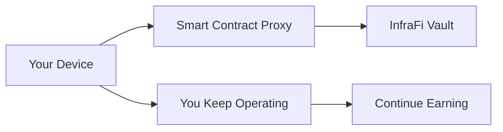

# Frequently Asked Questions

Common questions about InfraFi Protocol, answered clearly and comprehensively.

## General Questions

### What is InfraFi Protocol?

InfraFi is the first decentralized lending protocol designed specifically for Decentralized Physical Infrastructure Networks (DePIN). It allows owners of physical infrastructure devices—like OORT compute nodes, Helium miners, and Filecoin storage devices—to use their operational hardware as collateral to borrow digital tokens while maintaining full earning rights.

### How is InfraFi different from other DeFi lending protocols?

**Key Differences:**
- 🏗️ **Physical Asset Focus**: Designed specifically for infrastructure hardware, not digital assets
- 🔄 **Operational Continuity**: Your devices keep running and earning while serving as collateral  
- 🌐 **Multi-Protocol**: Supports diverse DePIN networks through modular adapters
- 🛡️ **Specialized Custody**: Innovative proxy system for physical asset management

### What does "DePIN" mean?

**DePIN** stands for **Decentralized Physical Infrastructure Networks**. These are blockchain networks that incentivize individuals to deploy and operate real-world hardware like wireless hotspots, storage nodes, compute servers, and IoT sensors in exchange for token rewards.

**Examples of DePIN Networks:**
- **OORT**: Edge computing and AI inference
- **Helium**: Wireless connectivity and IoT coverage
- **Filecoin**: Distributed storage infrastructure
- **Render Network**: GPU compute for rendering and AI

## Getting Started

### What do I need to start using InfraFi?

**Required Setup:**
- ✅ **Web3 Wallet** connected to OORT testnet (MetaMask recommended)
- ✅ **OORT Node** that you own and control
- ✅ **Testnet Tokens** (OORT for gas, WOORT for testing)
- ✅ **Basic DeFi Knowledge** (understanding of lending and collateral)

### Is it safe to try InfraFi?

**Yes, on testnet!** The current deployment is on OORT testnet using test tokens with no real value. It's specifically designed for safe learning and experimentation.


**Testnet Only**: Never deposit real mainnet assets to testnet contracts. Current deployment is for testing purposes only.


### How do I get testnet tokens?

**OORT Testnet Tokens:**
- Visit [OORT Faucet](https://faucet.oortech.com)
- Connect your wallet
- Request testnet OORT for gas fees

**WOORT Testnet Tokens:**
- Available through OORT testnet faucets
- Used as the borrowing currency in InfraFi
- No real value - testnet tokens only

## How InfraFi Works

### How does the proxy custody system work?

Instead of taking physical custody of your devices, InfraFi uses smart contract proxies:

1. **Transfer Ownership**: Your node ownership is transferred to an InfraFi proxy contract
2. **Maintain Control**: You keep full operational control and earning rights
3. **Automated Management**: The proxy handles ownership on behalf of the vault
4. **Easy Recovery**: Ownership automatically returns when you repay your loan



### What happens to my node rewards while it's collateral?

**You keep all rewards!** This is a key innovation of InfraFi:
- ✅ Your node continues operating normally
- ✅ All network rewards flow directly to you  
- ✅ No interruption to your income stream
- ✅ Device performance and uptime remain your responsibility

### How are my devices valued?

InfraFi uses **dynamic asset valuation** based on:

**For OORT Nodes:**
- **Staked Balance**: OORT tokens staked in the node
- **Earned Rewards**: Accumulated but potentially locked rewards
- **Total Value**: Combined staked amount and earnings
- **Real-Time Updates**: Values update based on network performance

**General Factors:**
- Hardware specifications and market value
- Historical earning performance  
- Network participation and uptime
- Market conditions and token prices

## Borrowing and Lending

### How much can I borrow against my devices?

**Current Limits (Testnet):**
- **Maximum LTV**: 80% of device value
- **Recommended**: Stay below 70% for safety
- **Example**: $1,000 device value = up to $800 borrowing capacity

**Calculation:**
```
Device Value: $1,000
× Max LTV (80%): 0.8
= Max Borrow: $800
```


**Mainnet will be more conservative**: Planned 50% max LTV for initial mainnet launch.


### What are the interest rates?

InfraFi uses a **Jump Rate Model** with dynamic rates based on utilization:

**Rate Parameters (Testnet):**
- **Base Rate**: 3% APY (minimum cost)
- **Multiplier**: 8% APY per 100% utilization  
- **Jump Rate**: 50% APY above 80% utilization
- **Typical Range**: 3-15% APY depending on demand

**Example Rates:**
| Pool Utilization | Interest Rate |
|------------------|---------------|
| 20% | 4.6% APY |
| 50% | 7.0% APY |
| 80% | 9.4% APY |
| 90% | 14.4% APY |

### How does repayment work?

**Flexible Repayment:**
- ✅ **Anytime**: Repay partial or full amount whenever you want
- ✅ **No Penalties**: No prepayment fees or penalties
- ✅ **Interest Only**: Make interest-only payments if preferred
- ✅ **Automatic Calculation**: System tracks principal and interest separately

**Process:**
1. Check your current debt (principal + accrued interest)
2. Approve WOORT spending for the vault contract
3. Call repay function with desired amount
4. Interest stops accruing on repaid portion

## Safety and Risks

### What is liquidation and how do I avoid it?

**Liquidation** occurs when your loan-to-value (LTV) ratio exceeds the safety threshold, triggering automatic sale of collateral to repay debt.

**Liquidation Triggers:**
- **Primary**: LTV exceeds 80% (testnet) / 60% (planned mainnet)
- **Causes**: Device value decline, interest accrual, market volatility

**Prevention Strategies:**
- 📊 **Monitor LTV**: Keep below 70% for safety margin
- 💰 **Maintain Reserves**: Keep WOORT for repayment and emergencies
- 🔧 **Device Health**: Ensure nodes operate properly to maintain value
- ⚠️ **Early Action**: Add collateral or repay before reaching threshold

### What are the main risks?

**Smart Contract Risk:**
- Code vulnerabilities or bugs
- **Mitigation**: Audits, testing, gradual rollout

**Liquidation Risk:**  
- Forced sale of collateral at unfavorable conditions
- **Mitigation**: Conservative LTV, monitoring, reserves

**Device Performance Risk:**
- Poor node performance reducing collateral value
- **Mitigation**: Proper maintenance, monitoring, backup plans

**Market Risk:**
- Token price volatility affecting ratios
- **Mitigation**: Diversification, conservative borrowing

**Network Risk:**
- DePIN protocol changes or issues
- **Mitigation**: Multi-protocol support, community involvement

### Is my OORT node safe?

**Security Measures:**
- ✅ **Smart Contract Audits**: Internal review completed, external audit planned
- ✅ **Tested Architecture**: Built on proven OpenZeppelin standards
- ✅ **Community Validation**: Open source with community review
- ✅ **Emergency Controls**: Pause and recovery mechanisms

**Your Responsibilities:**
- ✅ **Keep Operating**: Maintain node performance and uptime
- ✅ **Monitor Health**: Check device status regularly
- ✅ **Stay Informed**: Follow protocol and network updates

## Technical Questions

### Which DePIN protocols does InfraFi support?

**Currently Supported:**
- ✅ **OORT Network**: Live on testnet

**Planned Support (2025 Roadmap):**
- 🔄 **Helium Network**: Q2 2025
- 🔄 **Filecoin Network**: Q3 2025  
- 🔄 **Render Network**: Q4 2025
- 🔄 **Additional Protocols**: Community-driven integrations

### What blockchain networks does InfraFi use?

**Current:**
- ✅ **OORT Network**: Chain ID 970 (testnet and planned mainnet)

**Future Multi-Chain Support:**
- 📋 **Ethereum Mainnet**: Maximum security and liquidity
- 📋 **Polygon**: Lower gas costs for smaller operations
- 📋 **Arbitrum**: Layer 2 scaling benefits
- 📋 **Cross-Chain Bridges**: Unified liquidity across networks

### Can I integrate InfraFi into my application?

**Yes!** InfraFi provides comprehensive developer resources:
- 📖 **[API Documentation](../developers/api-reference.md)**: Complete interface reference
- 🛠️ **[Integration Guide](../developers/integration-guide.md)**: Step-by-step development guide  
- 📍 **[Contract Addresses](../developers/contract-addresses.md)**: Current deployment info
- 💬 **Developer Support**: Active Discord community and GitHub

## Troubleshooting

### Common Error Messages

#### "Node not owned by user"
**Cause**: Node ownership verification failed
**Solutions:**
- Verify you own the node in OORT's system
- Check node ID is correct and active
- Ensure node isn't already deposited elsewhere

#### "Insufficient collateral"
**Cause**: Trying to borrow more than LTV allows
**Solutions:**
- Check your node's current value
- Verify maximum LTV limits (80% on testnet)
- Try borrowing a smaller amount

#### "Transaction failed" or "Out of gas"
**Cause**: Insufficient gas fees or network issues
**Solutions:**
- Ensure sufficient OORT tokens for gas
- Check network connection to OORT testnet
- Try increasing gas limit or price

### Getting Help

**Community Support:**
- 💬 **Discord**: Real-time help in #support channel
- 🐛 **GitHub Issues**: Technical problems and bug reports
- 📚 **Documentation**: Comprehensive guides and resources

**Self-Help Resources:**
- 📖 **[User Guides](../guides/)**: Step-by-step instructions
- 🛡️ **[Safety Guidelines](../getting-started/safety-guidelines.md)**: Best practices
- 🔗 **[Community Links](community.md)**: Additional support channels

## Future Plans

### When will InfraFi launch on mainnet?

**Planned Timeline:**
- **Q1 2025**: OORT mainnet launch after security audit
- **Q2-Q3 2025**: Multi-protocol support (Helium, Filecoin)
- **Q4 2025**: Cross-chain deployment and advanced features

### Will there be a governance token?

**Yes, governance is planned:**
- **Phase 1** (Current): Foundation controlled with community input
- **Phase 2** (2025): Governance token distribution and DAO formation
- **Phase 3** (2026+): Full decentralized governance

### What about mobile support?

**Mobile Compatibility:**
- ✅ **Mobile Browsers**: Current web app works on mobile browsers
- 🔄 **Native Apps**: Mobile apps planned for future releases
- 📱 **Wallet Integration**: Full WalletConnect support for mobile wallets

## Still Have Questions?

**Can't find your answer?**

- 💬 **Ask on Discord**: Join our community for real-time support
- 🐛 **GitHub Issues**: Report bugs or request features  
- 📧 **Contact Team**: Reach out via official channels
- 📚 **Documentation**: Browse our comprehensive guides

---


**Remember**: We're here to help! Don't hesitate to ask questions in our community channels. The InfraFi community is friendly and supportive of newcomers.

