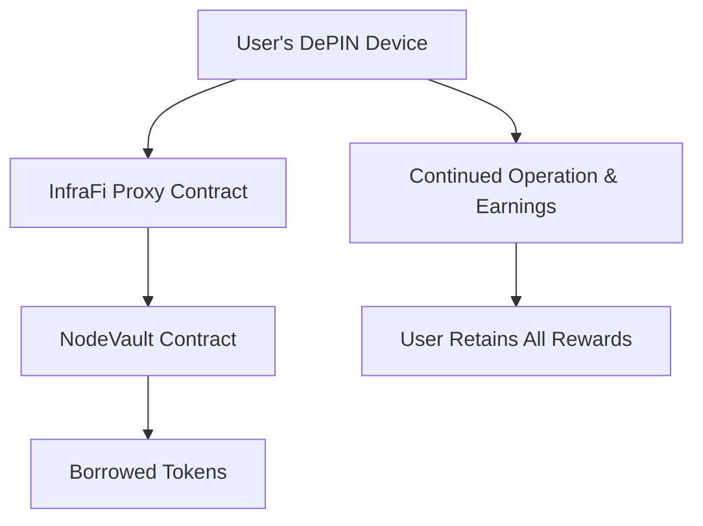

# InfraFi Protocol: Decentralized Physical Infrastructure Network (DePIN) Lending Protocol

**A Novel Approach to Unlocking Liquidity from Physical Infrastructure Assets**

---

**Version**: 1.0  
**Date**: December 2024  
**Authors**: InfraFi Protocol Team  
**License**: CC BY 4.0

---

## Abstract

InfraFi Protocol introduces the first decentralized lending protocol specifically designed for Decentralized Physical Infrastructure Networks (DePIN). The protocol enables owners of physical infrastructure devices—such as OORT compute nodes, Helium miners, and Filecoin storage devices—to use their operational hardware as collateral to borrow digital tokens while maintaining full earning rights from their infrastructure operations.

This whitepaper presents a novel financial primitive that bridges the physical and digital economies, creating a new asset class for DeFi while solving critical liquidity challenges in the rapidly growing DePIN ecosystem. The protocol maintains security through innovative proxy-based custody mechanisms and dynamic asset valuation systems that reflect real-time infrastructure performance.

**Key Innovations:**
- First-of-its-kind DePIN asset collateralization system
- Multi-protocol architecture supporting diverse infrastructure networks
- Dynamic asset valuation based on real-time device performance
- Non-custodial design preserving user control and earning rights
- Modular adapter system for seamless integration of new DePIN protocols

---

## 1. Introduction

### 1.1 The Emergence of Decentralized Physical Infrastructure Networks

The blockchain ecosystem has evolved beyond purely digital assets to encompass physical infrastructure through Decentralized Physical Infrastructure Networks (DePIN). These networks incentivize individuals to deploy and operate real-world hardware—such as wireless hotspots, storage nodes, compute servers, and IoT sensors—in exchange for token rewards.

The DePIN sector has experienced explosive growth, with over $25 billion in total value locked across various infrastructure networks as of 2024. Major protocols including Helium (wireless connectivity), Filecoin (distributed storage), OORT (edge computing), and Render Network (GPU compute) have demonstrated the viability of tokenizing physical infrastructure operations.

### 1.2 The Liquidity Challenge

Despite this growth, DePIN participants face a fundamental liquidity challenge: their valuable infrastructure assets are essentially illiquid. Node operators invest significant capital in hardware that generates steady returns through network participation, but accessing the underlying value requires selling the asset entirely, thereby terminating future earning potential.

This creates several critical problems:

**Capital Inefficiency**: Operators cannot leverage existing infrastructure investments to fund expansion or other opportunities without liquidating productive assets.

**Growth Constraints**: New participants face high barriers to entry due to upfront hardware costs, limiting network growth and decentralization.

**Economic Rigidity**: Infrastructure value is trapped in illiquid assets, preventing dynamic capital allocation and portfolio optimization.

**Opportunity Cost**: Operators must choose between maintaining earning assets and accessing capital for other investments.

### 1.3 Traditional Finance Limitations

While traditional finance offers asset-backed lending, several factors make conventional solutions inadequate for DePIN assets:

**Custody Complexity**: Physical infrastructure devices are geographically distributed and operationally active, making traditional custody models impractical.

**Valuation Challenges**: DePIN assets derive value from both hardware specifications and network earning potential, requiring specialized valuation methodologies.

**Operational Continuity**: Unlike traditional collateral, DePIN devices must remain operational to maintain value, creating unique custody requirements.

**Cross-Chain Integration**: DePIN networks operate across multiple blockchain ecosystems, requiring interoperability solutions beyond traditional finance capabilities.

---

## 2. Solution Architecture

### 2.1 Core Protocol Overview

InfraFi Protocol addresses the DePIN liquidity challenge through a novel decentralized lending system that enables infrastructure owners to borrow against their devices while maintaining operational control and earning rights. The protocol introduces several key innovations:

#### 2.1.1 Proxy-Based Custody Model

Rather than physical custody, InfraFi employs a sophisticated proxy system that manages on-chain ownership rights while preserving operator control:



**Key Features:**
- Device ownership is transferred to protocol-controlled proxy contracts
- Users maintain all operational control and earning rights
- Devices continue normal operation without interruption
- Automatic ownership recovery upon loan repayment

#### 2.1.2 Dynamic Asset Valuation

The protocol implements real-time asset valuation mechanisms that consider:

- **Hardware Value**: Base device specifications and market pricing
- **Earning Potential**: Historical and projected network rewards
- **Network Performance**: Device uptime, performance metrics, and network reputation
- **Market Conditions**: Token price fluctuations and network economics

### 2.2 Multi-Protocol Architecture

InfraFi's modular design supports diverse DePIN ecosystems through a unified adapter system:

#### 2.2.1 Protocol Adapter Registry

The `ProtocolAdapterRegistry` serves as the central coordination layer for supporting multiple DePIN networks:

```solidity
interface IProtocolAdapter {
    function getNodeValue(uint256 nodeId) external view returns (NodeValue memory);
    function getDepositSteps(uint256 nodeId, address currentOwner, address targetOwner) 
        external view returns (DepositStep[] memory);
    function getWithdrawalSteps(uint256 nodeId, address currentOwner, address targetOwner) 
        external view returns (WithdrawalStep[] memory);
}
```

#### 2.2.2 Supported Protocols (Phase 1)

**OORT Network**: Edge computing and AI inference infrastructure
- Node Type: Compute servers and edge devices  
- Valuation: Based on staked OORT tokens and computing rewards
- Integration Status: Live on testnet

**Future Integrations** (Roadmap):
- **Helium**: Wireless connectivity hotspots and 5G infrastructure
- **Filecoin**: Distributed storage provider networks  
- **Render Network**: GPU compute for rendering and AI workloads
- **IoTeX**: IoT device networks and sensor infrastructure

### 2.3 Vault System Architecture

The protocol's core functionality centers around the `NodeVaultUpgradeable` contract, which manages all lending operations:

#### 2.3.1 Core Components

```
NodeVaultUpgradeable
├── Deposit Management
│   ├── Node ownership verification
│   ├── Proxy deployment and assignment
│   └── Collateral value calculation
├── Lending Operations
│   ├── Borrowing capacity determination
│   ├── Interest rate calculation (Jump Rate Model)
│   └── Loan origination and management
├── Risk Management
│   ├── Loan-to-value monitoring
│   ├── Liquidation threshold enforcement
│   └── Emergency pause mechanisms
└── Proxy Coordination
    ├── NodeProxyManager integration
    ├── Multi-protocol adapter support
    └── Automated ownership transfers
```

#### 2.3.2 Node Proxy Management

The `NodeProxyManager` handles the complexity of protocol-specific ownership limits and proxy deployment:

- **Automatic Proxy Creation**: Deploys new proxy contracts when existing ones reach capacity
- **Protocol Limits**: Enforces network-specific constraints (e.g., OORT's 64-node limit per address)
- **Load Balancing**: Distributes nodes across proxies for optimal gas efficiency
- **Ownership Tracking**: Maintains comprehensive node-to-proxy mapping

---

## 3. Technical Implementation

### 3.1 Smart Contract Architecture

The InfraFi Protocol is implemented as a suite of interconnected smart contracts deployed on the OORT blockchain, with plans for multi-chain expansion:

#### 3.1.1 Contract Hierarchy

```
Core Contracts:
├── NodeVaultUpgradeable (Main vault and lending logic)
├── NodeProxyManager (Proxy lifecycle management)  
├── ProtocolAdapterRegistry (Multi-protocol coordination)
└── NodeOwnershipProxy[] (Individual node custody contracts)

Protocol Adapters:
├── OortProtocolAdapter (OORT network integration)
├── HeliumProtocolAdapter (Future - Helium network)
└── FilecoinProtocolAdapter (Future - Filecoin network)

Composability Layer:
├── PositionNFT (Future - Transferable lending positions)
└── DeFiBridge (Future - Cross-protocol yield optimization)
```

#### 3.1.2 Current Deployment (OORT Testnet)

**Network**: OORT Testnet (Chain ID: 970)  
**Deployment Date**: December 30, 2024  
**Contract Addresses**:

```
NodeVaultUpgradeable: 0x74f68Eec49DFAd34E22f3f6F3e38d4d92D8ab676
ProtocolAdapterRegistry: 0xC3305D14cbE9d1bE5BF9E601085525bB4a491a96  
NodeProxyManager: 0xAd85e8Ac6be7323D720332428AbAdC235442d825
OortProtocolAdapter: 0xE2c3d808B6FCEC0bCda60DC1f612D83fD6265E8f
```

### 3.2 Deposit and Withdrawal Mechanisms

#### 3.2.1 Node Deposit Process

The deposit mechanism ensures secure transfer of node ownership while preserving operational continuity:

```solidity
function depositNodes(uint256[] calldata nodeIds, uint256[] calldata nodeTypes) 
    external nonReentrant notInEmergency {
    
    for (uint256 i = 0; i < nodeIds.length; i++) {
        // 1. Verify user owns the node
        _verifyNodeOwnership(nodeIds[i], nodeTypes[i], msg.sender);
        
        // 2. Get or create appropriate proxy  
        address proxy = proxyManager.getOrCreateProxy(nodeTypes[i]);
        
        // 3. Execute ownership transfer through adapter
        _executeDeposit(nodeIds[i], nodeTypes[i], msg.sender, proxy);
        
        // 4. Record deposit and update user's collateral
        _recordSuccessfulDeposit(nodeIds[i], nodeTypes[i], msg.sender);
    }
}
```

#### 3.2.2 Withdrawal Security

Node withdrawal incorporates multiple safety checks to prevent unauthorized access:

```solidity
function withdrawNodes(uint256[] calldata nodeIds, uint256[] calldata nodeTypes) 
    external nonReentrant notInEmergency {
    
    // 1. Verify user has no outstanding debt
    require(getUserDebt(msg.sender) == 0, "OutstandingLoanMustBeRepaid");
    
    // 2. Execute withdrawal for each node
    for (uint256 i = 0; i < nodeIds.length; i++) {
        _executeWithdrawal(nodeIds[i], nodeTypes[i], msg.sender);
        _recordSuccessfulWithdrawal(nodeIds[i], nodeTypes[i], msg.sender);
    }
}
```

### 3.3 Asset Valuation System

#### 3.3.1 OORT Node Valuation

The OORT protocol adapter implements comprehensive asset valuation based on the OORT network's tokenomics:

```solidity
function getNodeValue(uint256 nodeId) external view returns (NodeValue memory) {
    address nodeAddress = nodeIdToAddress(nodeId);
    
    // Query OORT network for current node data
    (
        address ownerAddress,
        uint256 id, 
        uint256 balance,        // Total asset value (pledge + rewards)
        uint256 lockedRewards,  // Unvested portion
        uint256 maxPledge,
        uint256 endTime,
        uint256 nodeType,
        uint256 lockTime
    ) = IOortNode(oortNodeContract).nodeDataInfo(nodeAddress);
    
    return NodeValue({
        totalValue: balance,                    // Complete asset value
        liquidValue: balance - lockedRewards,  // Immediately accessible
        collateralValue: balance,               // Available for borrowing
        lastUpdate: block.timestamp
    });
}
```

#### 3.3.2 Multi-Protocol Valuation

The modular adapter system allows each protocol to implement custom valuation logic while maintaining consistent interfaces:

- **Hardware-Based Valuation**: Base device value from specifications and market pricing
- **Performance-Based Adjustments**: Rewards based on network participation and uptime
- **Risk-Adjusted Pricing**: Discounts for volatile or illiquid reward tokens
- **Time-Weighted Averaging**: Smoothing mechanisms to prevent manipulation

### 3.4 Interest Rate Model

InfraFi implements a Jump Rate Model optimized for DePIN asset characteristics:

#### 3.4.1 Rate Calculation

```solidity
function calculateInterestRate(uint256 cash, uint256 borrows) internal view returns (uint256) {
    uint256 utilization = (borrows * BASE_POINTS) / (cash + borrows);
    
    if (utilization <= kink) {
        // Below kink: linear rate increase
        return baseRatePerYear + (utilization * multiplierPerYear) / BASE_POINTS;
    } else {
        // Above kink: jump rate kicks in
        uint256 normalRate = baseRatePerYear + (kink * multiplierPerYear) / BASE_POINTS;
        uint256 excessUtil = utilization - kink;
        return normalRate + (excessUtil * jumpMultiplierPerYear) / BASE_POINTS;
    }
}
```

#### 3.4.2 Rate Parameters (Testnet Configuration)

- **Base Rate**: 3% APY (minimum borrowing cost)
- **Multiplier**: 8% APY per 100% utilization (below kink)  
- **Jump Multiplier**: 50% APY per 100% utilization (above kink)
- **Kink**: 80% utilization (optimal supply/demand balance)

---

## 4. Economic Model and Tokenomics

### 4.1 Value Accrual Mechanisms

InfraFi Protocol generates value through multiple revenue streams while maintaining sustainable economics for all participants:

#### 4.1.1 Interest Revenue

**Primary Revenue**: Interest payments from borrowers provide the foundation of protocol economics
- Borrowers pay interest on outstanding loans calculated per block
- Interest rates dynamically adjust based on supply and demand (utilization)
- Revenue flows to liquidity providers (lenders) and protocol treasury

#### 4.1.2 Liquidation Incentives

**Secondary Revenue**: Liquidation events generate fee revenue while maintaining system health
- 5% liquidation bonus provides economic incentive for liquidators
- Liquidation threshold at 80% LTV protects lenders from losses
- Automated liquidation system ensures system solvency

#### 4.1.3 Future Revenue Streams

**Planned Enhancements** (Phase 2 and beyond):
- Protocol fees on lending volume
- Premium features for institutional users
- Cross-chain bridge fees for multi-network operations
- DAO governance token value capture

### 4.2 Risk Management Framework

#### 4.2.1 Collateralization Ratios

The protocol implements conservative collateralization requirements balanced with capital efficiency:

**Testnet Parameters** (Higher risk tolerance for testing):
- Maximum LTV: 80%
- Liquidation Threshold: 80%
- Liquidation Bonus: 5%

**Planned Mainnet Parameters** (Conservative for initial launch):
- Maximum LTV: 50%
- Liquidation Threshold: 60%
- Liquidation Bonus: 10%

#### 4.2.2 Asset Quality Controls

**Node Eligibility Requirements**:
- Minimum operational history (30 days)
- Consistent network participation and uptime
- Valid ownership verification through native protocol
- No history of network violations or penalties

**Ongoing Monitoring**:
- Real-time asset value tracking
- Performance-based adjustments
- Network health indicators
- Correlation risk assessment across multiple protocols

### 4.3 Liquidity Mining and Incentives

#### 4.3.1 Supply-Side Incentives

**Lender Rewards**: Liquidity providers earn both organic interest and protocol incentives
- Base yield from borrower interest payments
- Additional token rewards for early adoption
- Governance rights through protocol tokens
- Priority access to new features and protocols

#### 4.3.2 Demand-Side Growth

**Borrower Benefits**: Competitive rates and unique value proposition drive adoption
- Below-market interest rates for high-quality collateral
- Maintain earning rights on deposited infrastructure
- Access to liquidity without asset liquidation
- Flexible repayment terms and partial payments

---

## 5. Security and Risk Management

### 5.1 Smart Contract Security

#### 5.1.1 Security Architecture

InfraFi Protocol implements multiple layers of security controls:

**Access Controls**:
```solidity
// Multi-role access control system
modifier onlyOwner() { require(msg.sender == owner(), "Not authorized"); _; }
modifier notInEmergency() { require(emergencyStop == 0, "Emergency stop active"); _; }
modifier onlyAuthorizedLiquidator() { 
    require(authorizedLiquidators[msg.sender], "Not authorized liquidator"); 
    _; 
}
```

**Reentrancy Protection**:
- OpenZeppelin `ReentrancyGuard` on all external functions
- Checks-Effects-Interactions pattern throughout codebase
- State updates before external calls

**Emergency Controls**:
- Pausable functionality for critical operations
- Time-locked upgrades with community governance
- Emergency liquidation capabilities
- Fund recovery mechanisms

#### 5.1.2 Audit and Verification

**Current Status**: 
- Internal security review completed
- Test coverage exceeding 90% for core functions
- Deployment on testnet for community validation

**Planned Security Measures**:
- Professional security audit before mainnet launch
- Formal verification of critical functions
- Bug bounty program for ongoing security
- Multi-signature controls for administrative functions

### 5.2 Operational Risk Management

#### 5.2.1 Oracle and Price Feed Security

**Asset Valuation Risks**:
- Direct integration with native protocol contracts reduces oracle dependency
- Multiple valuation sources for cross-verification
- Time-weighted average pricing to prevent manipulation
- Circuit breakers for extreme price movements

**Network Integration Risks**:
- Comprehensive testing with native protocol behaviors
- Fallback mechanisms for network outages
- Rate limiting on critical operations
- Monitoring and alerting systems

#### 5.2.2 Liquidation System Robustness

**Liquidation Mechanics**:
```solidity
function liquidate(
    address borrower,
    uint256 repayAmount,
    uint256[] calldata nodeIds,
    uint256[] calldata nodeTypes
) external onlyAuthorizedLiquidator liquidationCooldown(borrower) {
    
    // 1. Verify borrower is liquidatable
    require(_isLiquidatable(borrower), "Borrower not liquidatable");
    
    // 2. Validate liquidation amount
    uint256 maxRepayAmount = _calculateMaxLiquidation(borrower);
    require(repayAmount <= maxRepayAmount, "Liquidation amount too high");
    
    // 3. Execute liquidation with bonus
    _executeLiquidation(borrower, repayAmount, nodeIds, nodeTypes);
}
```

**Liquidation Safeguards**:
- 1-block cooldown between liquidations per borrower
- Maximum 5 liquidations per block (system-wide rate limiting)
- Authorized liquidator system with reputation requirements
- Partial liquidation support to minimize borrower impact

### 5.3 Decentralization and Governance

#### 5.3.1 Progressive Decentralization Plan

**Phase 1 - Foundation Control** (Current):
- Core team maintains administrative control
- Focus on protocol stability and security
- Community feedback integration and testing

**Phase 2 - Governance Transition** (6-12 months):
- Governance token distribution to early users
- DAO formation and voting mechanism deployment
- Gradual transfer of administrative functions

**Phase 3 - Full Decentralization** (12+ months):
- Community-controlled parameter adjustments
- Protocol upgrade governance
- Treasury management by DAO
- Fully autonomous operations

#### 5.3.2 Governance Framework

**Governance Scope**:
- Protocol parameter adjustments (LTV ratios, interest rates)
- New protocol integration approvals
- Emergency response coordination
- Treasury allocation and spending
- Upgrade implementation and timing

**Voting Mechanisms**:
- Time-weighted voting power based on protocol usage
- Minimum participation thresholds for major decisions
- Emergency voting procedures for critical issues
- Delegate voting for improved participation

---

## 6. Market Analysis and Competitive Positioning

### 6.1 Total Addressable Market

#### 6.1.1 DePIN Market Size

The Decentralized Physical Infrastructure Network sector represents a rapidly expanding market opportunity:

**Current Market Metrics** (2024):
- Total Value Locked: $25+ billion across DePIN protocols
- Active Infrastructure Devices: 500,000+ nodes globally
- Annual Hardware Investment: $5+ billion in new deployments
- Geographic Distribution: 180+ countries with active participation

**Growth Projections** (2025-2027):
- Compound Annual Growth Rate: 45-60% projected
- Addressable Device Population: 2+ million nodes by 2027
- Infrastructure Investment: $50+ billion cumulative deployment
- Protocol Diversity: 100+ active DePIN networks anticipated

#### 6.1.2 Lending Market Opportunity

**DeFi Lending Market Context**:
- Total Value Locked in DeFi Lending: $50+ billion (2024)
- Average Lending Utilization: 60-70% across major protocols
- Unmet Demand: Significant supply constraints during market cycles

**DePIN-Specific Opportunity**:
- Illiquid Infrastructure Value: $15+ billion in deployed hardware
- Capital Efficiency Gap: 0% current liquidity utilization
- Target Addressable Market: $7.5 billion potential borrowing capacity (50% LTV)

### 6.2 Competitive Landscape

#### 6.2.1 Traditional DeFi Lending

**Established Protocols**:
- **Compound**: $8 billion TVL, focus on liquid crypto assets
- **Aave**: $12 billion TVL, diverse asset support and features  
- **MakerDAO**: $6 billion TVL, primarily DAI stablecoin minting

**Competitive Differentiation**:
- InfraFi targets entirely new asset class (physical infrastructure)
- No existing protocol serves DePIN collateralization needs
- Unique custody and valuation challenges require specialized solutions

#### 6.2.2 Physical Asset Tokenization

**Related Approaches**:
- **Real Estate Tokenization**: Platforms like RealT and Lofty
- **Commodity Financing**: Traditional trade finance and inventory financing
- **Equipment Leasing**: Traditional equipment financing markets

**InfraFi Advantages**:
- Native blockchain integration eliminates bridging complexity
- Real-time asset performance monitoring and valuation
- Operational continuity preserves asset productivity
- Decentralized governance aligns with DePIN ethos

#### 6.2.3 DePIN-Adjacent Financial Services

**Emerging Solutions**:
- **Network-Specific Lending**: Individual protocol treasury programs
- **Hardware Financing**: Traditional lease-to-own arrangements
- **Token-Based Financing**: Collateralization using reward tokens only

**Market Positioning**:
- InfraFi provides universal solution across all DePIN networks
- Superior capital efficiency through infrastructure-backed lending
- Reduced counterparty risk through on-chain automation
- Scalable architecture supporting ecosystem growth

### 6.3 Go-to-Market Strategy

#### 6.3.1 Phase 1: OORT Network Integration

**Target Audience**: OORT node operators and community
- **Primary Users**: 5,000+ active OORT node operators
- **Value Proposition**: Unlock liquidity from $10M+ in deployed infrastructure
- **Launch Strategy**: Testnet validation followed by conservative mainnet parameters

**Success Metrics**:
- 100+ active borrowers within first quarter
- $1M+ in total value locked within six months
- <1% liquidation rate maintaining system health

#### 6.3.2 Phase 2: Multi-Protocol Expansion

**Network Prioritization**:
1. **Helium**: Large established user base, standardized hardware
2. **Filecoin**: High-value storage infrastructure, clear valuation metrics
3. **Render Network**: GPU assets with quantifiable utility value

**Integration Strategy**:
- Community-driven adapter development
- Partnership with protocol foundations
- Governance token incentives for early adopters

#### 6.3.3 Phase 3: Ecosystem Integration

**DeFi Composability**:
- Integration with yield aggregators (Yearn, Beefy)
- Collateral accepted by other lending protocols
- Cross-protocol yield optimization strategies

**Institutional Services**:
- White-label solutions for DePIN protocols
- Institutional lending products
- Analytics and risk management tools

---

## 7. Roadmap and Future Development

### 7.1 Technical Roadmap

#### 7.1.1 Short-Term Milestones (Q1-Q2 2025)

**Q1 2025: Mainnet Launch**
- [ ] Security audit completion and remediation
- [ ] OORT mainnet deployment with conservative parameters
- [ ] Multi-signature governance implementation
- [ ] Basic frontend interface launch

**Q2 2025: Core Feature Enhancement**
- [ ] Advanced liquidation mechanics
- [ ] Partial repayment functionality
- [ ] Interest rate optimization based on usage data
- [ ] Mobile-responsive interface improvements

#### 7.1.2 Medium-Term Development (Q3-Q4 2025)

**Q3 2025: Multi-Protocol Support**
- [ ] Helium protocol adapter development and testing
- [ ] Filecoin integration proof-of-concept
- [ ] Cross-protocol risk assessment framework
- [ ] Advanced analytics dashboard

**Q4 2025: Composability Layer**
- [ ] PositionNFT implementation (transferable positions)
- [ ] Integration with major DeFi yield protocols
- [ ] Cross-chain bridge development initiation
- [ ] Governance token launch and distribution

#### 7.1.3 Long-Term Vision (2026+)

**2026: Ecosystem Maturity**
- [ ] Support for 10+ major DePIN protocols
- [ ] Multi-chain deployment (Ethereum, Polygon, Arbitrum)
- [ ] Institutional-grade features and compliance
- [ ] Automated yield optimization strategies

**2027+: Market Leadership**
- [ ] Industry standard for DePIN asset financing
- [ ] Educational resources and developer tools
- [ ] Research and development partnerships
- [ ] Next-generation infrastructure finance innovation

### 7.2 Protocol Evolution

#### 7.2.1 Governance Maturation

**Decentralization Timeline**:
- **Months 1-6**: Foundation-controlled parameters with community input
- **Months 6-12**: Gradual parameter control transfer to DAO
- **Year 2+**: Fully decentralized governance and protocol evolution

**Governance Mechanisms**:
- Parameter adjustment proposals and voting
- Protocol upgrade approval processes
- Treasury management and allocation
- Emergency response coordination

#### 7.2.2 Economic Model Evolution

**Fee Structure Development**:
- Introduction of protocol fees based on usage metrics
- Tiered service levels for different user classes
- Revenue sharing with governance token holders
- Sustainability mechanisms for long-term operations

**Tokenomics Optimization**:
- Data-driven parameter adjustments
- Risk model refinement based on liquidation history
- Cross-protocol correlation analysis
- Market-responsive rate mechanisms

### 7.3 Ecosystem Development

#### 7.3.1 Developer Ecosystem

**Technical Integration**:
- Comprehensive API documentation and SDKs
- Integration guides for new DePIN protocols
- Developer grants and bounty programs
- Technical workshops and educational content

**Community Building**:
- Open-source development contributions
- Protocol improvement proposals (PIPs)
- Developer advocacy and support programs
- Hackathon sponsorship and participation

#### 7.3.2 Strategic Partnerships

**Protocol Partnerships**:
- Native integration with major DePIN networks
- Joint product development initiatives
- Cross-protocol incentive programs
- Shared security and risk management

**Infrastructure Partnerships**:
- Oracle providers for enhanced data feeds
- Security audit firms for ongoing verification
- Institutional custody and compliance providers
- Analytics and monitoring service integrations

---

## 8. Conclusion

### 8.1 Innovation Summary

InfraFi Protocol represents a paradigm shift in decentralized finance, introducing the first lending protocol specifically designed for physical infrastructure assets. By solving the fundamental liquidity challenge facing DePIN participants, InfraFi unlocks billions of dollars in previously illiquid value while maintaining the productive capacity of infrastructure networks.

The protocol's key innovations address critical market needs:

**Novel Asset Class**: Physical infrastructure devices become productive DeFi collateral for the first time, creating an entirely new category of backed assets.

**Operational Continuity**: Unlike traditional collateral systems, InfraFi preserves the productive capacity of deposited assets, enabling users to maintain earnings while accessing liquidity.

**Multi-Protocol Architecture**: The modular adapter system supports diverse DePIN ecosystems through a unified interface, creating network effects and economies of scale.

**Dynamic Valuation**: Real-time asset valuation based on both hardware value and network performance provides accurate and responsive collateral pricing.

### 8.2 Market Impact Potential

The InfraFi Protocol addresses a market opportunity exceeding $7.5 billion in potential borrowing capacity, serving over 500,000 active infrastructure operators across global DePIN networks. By providing capital efficiency solutions for this rapidly growing sector, InfraFi can accelerate DePIN adoption while generating sustainable revenue through interest and fee mechanisms.

The protocol's success will drive broader implications for both DeFi and physical infrastructure markets:

**DeFi Expansion**: Introduction of physical-backed assets expands DeFi beyond purely digital collateral, improving risk diversification and market stability.

**Infrastructure Investment**: Enhanced capital efficiency accelerates DePIN network growth and geographic expansion through improved unit economics.

**Financial Innovation**: Establishment of infrastructure finance primitives enables development of more sophisticated products and services.

### 8.3 Risk Considerations and Mitigation

While InfraFi Protocol introduces significant innovation, several risk factors require careful management:

**Technical Complexity**: Integration with diverse DePIN protocols creates operational complexity, mitigated through extensive testing and gradual rollout.

**Market Volatility**: Physical infrastructure value correlation with token markets requires sophisticated risk management and conservative parameters.

**Regulatory Evolution**: Evolving regulatory frameworks for DeFi and physical asset tokenization require adaptive compliance strategies.

**Network Dependencies**: Reliance on underlying DePIN protocol stability necessitates diversification and redundancy planning.

### 8.4 Future Outlook

InfraFi Protocol is positioned to become the foundational infrastructure finance layer for the decentralized economy. As DePIN networks continue expanding and maturing, the demand for sophisticated financial services will grow proportionally. InfraFi's early-mover advantage, technical innovation, and community-driven development model create strong foundations for long-term success.

The protocol's roadmap emphasizes sustainable growth through conservative risk management, gradual decentralization, and continuous innovation. By maintaining focus on core value propositions while expanding capabilities, InfraFi aims to establish the standard for physical infrastructure finance in decentralized markets.

Through successful execution of its vision, InfraFi Protocol will bridge the gap between physical and digital economies, creating value for infrastructure operators, DeFi participants, and the broader blockchain ecosystem while advancing the fundamental goal of financial sovereignty through decentralized systems.

---

## References and Additional Resources

### Technical Documentation
- InfraFi Protocol Smart Contracts: [GitHub Repository]
- API Documentation: [Technical Documentation Portal]
- Security Audit Reports: [Audit Repository]

### DePIN Ecosystem Research
- Messari DePIN Research Reports
- OORT Network Technical Documentation
- Helium Network Economics Whitepaper
- Filecoin Storage Provider Economics

### DeFi Lending Protocol Analysis
- Compound Protocol Documentation and Governance
- Aave Protocol Technical Papers
- MakerDAO Stability and Governance Framework

### Market Research and Data
- DeFiPulse Lending Protocol Analytics
- DePIN Market Analysis and Projections
- Blockchain Infrastructure Investment Reports

---

**Disclaimer**: This whitepaper is for informational purposes only and does not constitute financial advice. DeFi protocols involve significant risks including smart contract vulnerabilities, market volatility, and regulatory changes. Users should conduct thorough research and consider their risk tolerance before participating.

**License**: This document is licensed under Creative Commons Attribution 4.0 International License. You are free to share and adapt this content with appropriate attribution to InfraFi Protocol.

---

*For the latest updates and developments, visit the InfraFi Protocol documentation portal and join our community channels.*
